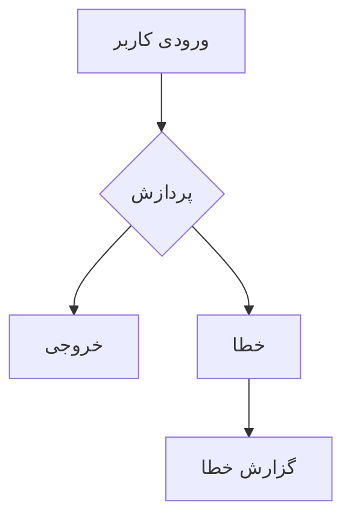
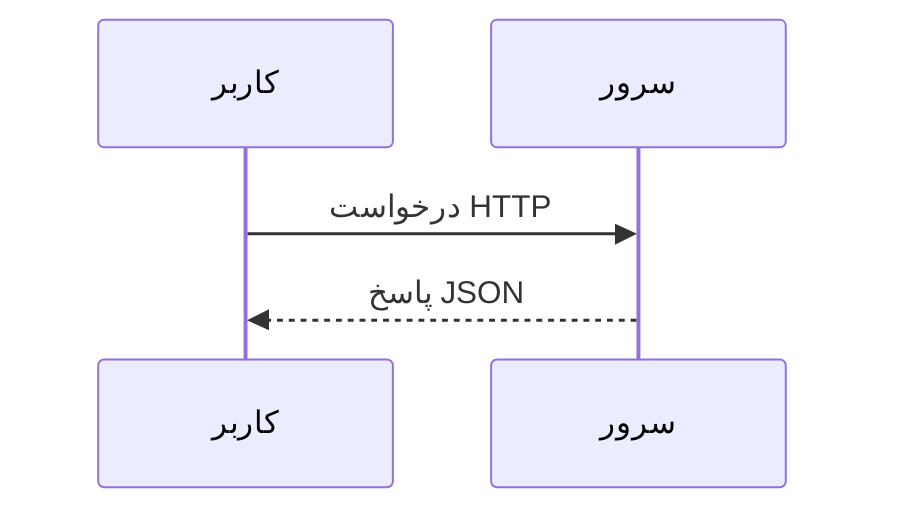
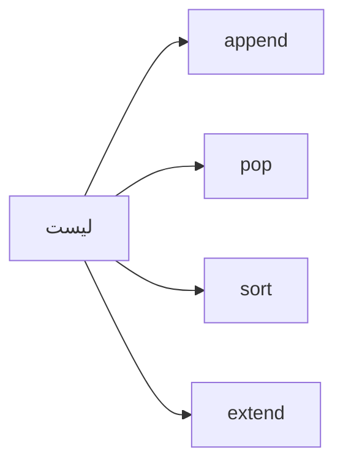
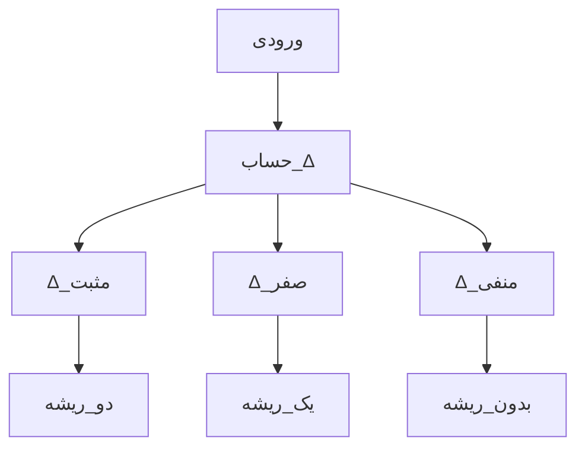
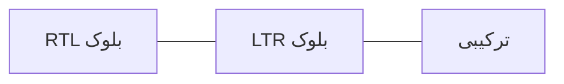
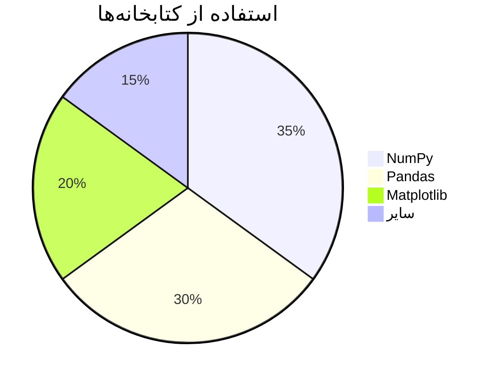
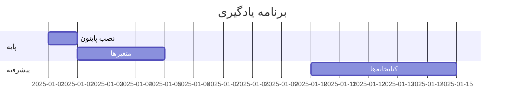

---
title: راهنمای جامع برنامه‌نویسی پایتون
slug: doc-60323
date: '2025-01-15'
lang: fa
dir: rtl
type: article
tags: []
categories: []
description: آموزش جامع پایتون
keywords: []
toc: true
math: true
mermaid: true
codeHighlight: true
sourceFormat: html
sourceFile: sample-page.html
assets:
  images: []
  files: []
noindex: false
converterVersion: 0.1.0
qualityScore: 0.0
convertedAt: '2026-02-19T00:18:43.082325+00:00'
---

import Details from '@/components/ui/Details';
import Figure from '@/components/media/Figure';

{/* === بخش ۱: سرصفحه === */}


# راهنمای جامع برنامه‌نویسی پایتون


این سند یک راهنمای کامل برای یادگیری زبان برنامه‌نویسی پایتون است.


- [فصل ۱: مقدمه](#chapter1)
- [فصل ۲: داده‌ساختارها](#chapter2)
- [فصل ۳: ریاضیات](#chapter3)


{/* === بخش ۲: فصل اول === */}


## فصل اول: مقدمه‌ای بر پایتون


پایتون یکی از محبوب‌ترین زبان‌های برنامه‌نویسی مدرن است.
 این زبان با **سینتکس ساده** و *خوانایی بالا* شناخته می‌شود.


> «زبانی که به راحتی نوشته می‌شود و به راحتی خوانده می‌شود.»
>
>
> *گیدو ون روسوم*


{/* نمودار معماری */}








{/* جدول ساده */}


### مقایسه زبان‌ها


*مقایسه ویژگی‌های زبان‌های برنامه‌نویسی*


| زبان | سرعت یادگیری | کاربرد اصلی | امتیاز |
| ---- | ------------ | ----------- | ------ |
| پایتون | سریع | علم داده، هوش مصنوعی | ۹/۱۰ |
| جاوا | متوسط | اپلیکیشن سازمانی | ۷/۱۰ |
| جاوااسکریپت | سریع | توسعه وب | ۸/۱۰ |


{/* کد نمونه */}


### مثال اول


```python

# برنامه Hello World در پایتون
def hello_world():
    # چاپ سلام دنیا
    print("سلام دنیا!")  # خروجی: سلام دنیا

hello_world()
  
```


{/* === بخش ۳: فصل دوم === */}


## فصل دوم: داده‌ساختارهای پایتون


پایتون دارای انواع داده‌ای مختلف است. در این فصل با آن‌ها آشنا می‌شویم.


{/* جدول ادغامی */}


### انواع داده‌ای


<div style={{overflowX: 'auto'}}>
<table>
<thead>
<tr>
<th colSpan={3}>انواع داده‌ای پایتون</th>
</tr>
<tr>
<th>دسته</th>
<th>نوع</th>
<th>مثال</th>
</tr>
</thead>
<tbody>
<tr>
<td rowSpan={2}>اعداد</td>
<td>صحیح</td>
<td>42</td>
</tr>
<tr>
<td>اعشاری</td>
<td>3.14</td>
</tr>
<tr>
<td rowSpan={2}>دنباله</td>
<td>لیست</td>
<td>[1, 2, 3]</td>
</tr>
<tr>
<td>تاپل</td>
<td>(1, 2, 3)</td>
</tr>
</tbody>
</table>
</div>


{/* کد نمونه */}


```python

# نمونه داده‌ساختارها
numbers = [1, 2, 3, 4, 5]
coordinates = (10.5, 20.3)
person = {"name": "علی", "age": 25}
unique_vals = {1, 2, 3, 3, 2}
  
```


{/* جدول ساده دیگر */}


| متد | توضیح |
| --- | ----- |
| append() | افزودن عنصر به انتهای لیست |
| pop() | حذف و بازگشت آخرین عنصر |
| sort() | مرتب‌سازی لیست |





{/* تصویر */}


<Figure caption="شکل ۱: نمایش گرافیکی داده‌ساختارها در پایتون">

<Image src="images/data-structures.png" alt="نمودار داده‌ساختارها" width={800} height={400} />

</Figure>


{/* === بخش ۴: فصل سوم — ریاضیات === */}


## فصل سوم: ریاضیات در پایتون


پایتون ابزارهای قدرتمندی برای محاسبات ریاضی دارد.


{/* فرمول‌های ریاضی — KaTeX style */}


### ۳.۱ فرمول‌های پایه


معادله درجه دوم:
 $ax^2 + bx + c = 0$


فرمول حل معادله درجه دوم:
 $x = \frac{-b \pm \sqrt{b^2 - 4ac}}{2a}$


{/* فرمول display mode */}


$$
\int_{-\infty}^{\infty} e^{-x^2} dx = \sqrt{\pi}
$$


$$
\sum_{n=1}^{\infty} \frac{1}{n^2} = \frac{\pi^2}{6}
$$


{/* فرمول‌های inline */}


انرژی در فیزیک: $E = mc^2$


قضیه فیثاغورث: $a^2 + b^2 = c^2$


ماتریس A:
 

$$
A = \begin{pmatrix} a_{11} & a_{12} \\ a_{21} & a_{22} \end{pmatrix}
$$


{/* جدول با فرمول */}


| مفهوم | فرمول |
| ----- | ----- |
| انتگرال | ∫f(x)dx |
| مشتق | f'(x) |
| حد | lim f(x) |


{/* بلوک کد پایتون */}


```python

import math

# محاسبه معادله درجه دوم
def quadratic(a, b, c):
    discriminant = b**2 - 4*a*c
    if discriminant < 0:
        return None  # بدون ریشه حقیقی
    x1 = (-b + math.sqrt(discriminant)) / (2*a)
    x2 = (-b - math.sqrt(discriminant)) / (2*a)
    return x1, x2

print(quadratic(1, -5, 6))  # (3.0, 2.0)
  
```





{/* === بخش ۵: رسانه === */}


## فصل چهارم: رسانه


{/* ویدئو */}


### ویدئوی آموزشی


<Video src="videos/python-intro.mp4" width={800} height={450} controls={true} />


{/* صوت */}


### فایل صوتی


<Audio src="audio/lecture.mp3" controls={true} />


{/* iframe */}


### ویدئوی یوتیوب


<Embed src="https://www.youtube.com/embed/dQw4w9WgXcQ" title="ویدئوی آموزشی پایتون" width={800} height={450} />


{/* SVG inline */}


### نمودار SVG


<Image src="./sample-page-svg-1-c37afb3c.svg" alt="SVG figure 1" />


{/* === بخش ۶: عناصر خاص === */}


## فصل پنجم: عناصر ویژه


{/* mark */}


این <mark>بخش مهم</mark> را نباید از دست بدهید.


{/* kbd */}


برای اجرای برنامه، <kbd>Ctrl</kbd>+<kbd>F5</kbd> را فشار دهید.


{/* abbr */}


زبان <abbr title="Artificial Intelligence">AI</abbr> از پایتون استفاده می‌کند.


{/* time */}


تاریخ انتشار: <time dateTime="2025-01-15">۱۵ ژانویه ۲۰۲۵</time>


{/* ins/del */}


متن قدیمی: ~~روش قدیمی~~ | متن جدید: <ins>روش جدید</ins>


{/* sup/sub */}


فرمول آب: H<sub>2</sub>O و ناحیه: m<sup>2</sup>


{/* details */}


<Details summary="توضیحات بیشتر درباره پایتون">

پایتون توسط گیدو ون روسوم طراحی شده و در سال ۱۹۹۱ منتشر شد.


این زبان یک زبان تفسیری، شیء‌گرا و سطح بالا است.


- ساده و خوانا
- کتابخانه‌های فراوان
- جامعه بزرگ

</Details>


{/* details بیشتر */}


<Details summary="منابع یادگیری">

1. [مستندات رسمی](https://docs.python.org)
2. [Real Python](https://realpython.com)

</Details>


{/* progress */}


پیشرفت یادگیری:
 <progress value={75} max={100}>۷۵٪</progress>


{/* meter */}


کیفیت کد:
 <meter value={0.8} min={0} max={1}>۸۰٪</meter>


{/* === بخش ۷: RTL/LTR === */}


## فصل ششم: دوجهته‌نویسی


<div dir="rtl">

این متن از راست به چپ نوشته شده است.


پایتون از متن فارسی پشتیبانی می‌کند.

</div>


<div dir="ltr">

This is an LTR (Left-to-Right) paragraph in English.


Python supports both RTL and LTR text.

</div>


<div lang="en">

This paragraph has English language specified.


```bash
python3 --version
pip install numpy

```

</div>





{/* === بخش ۸: جداول بیشتر === */}


## فصل هفتم: جداول پیشرفته


{/* جدول با tfoot */}


<div style={{overflowX: 'auto'}}>
<table>
<thead>
<tr>
<th>کتابخانه</th>
<th>نسخه</th>
<th>کاربرد</th>
</tr>
</thead>
<tbody>
<tr>
<td>NumPy</td>
<td>1.24</td>
<td>محاسبات عددی</td>
</tr>
<tr>
<td>Pandas</td>
<td>2.0</td>
<td>تحلیل داده</td>
</tr>
<tr>
<td>Matplotlib</td>
<td>3.7</td>
<td>رسم نمودار</td>
</tr>
</tbody>
<tfoot>
<tr>
<td colSpan={3}>مجموع ۳ کتابخانه محبوب</td>
</tr>
</tfoot>
</table>
</div>


{/* جدول ادغامی پیچیده */}


<div style={{overflowX: 'auto'}}>
<table>
<thead>
<tr>
<th rowSpan={2}>کتابخانه</th>
<th colSpan={2}>پشتیبانی</th>
</tr>
<tr>
<th>پایتون ۳.x</th>
<th>پایتون ۲.x</th>
</tr>
</thead>
<tbody>
<tr>
<td>NumPy</td>
<td>✓</td>
<td>✗</td>
</tr>
<tr>
<td>Pandas</td>
<td>✓</td>
<td>✗</td>
</tr>
</tbody>
</table>
</div>








{/* === بخش ۹: فرم === */}


## فصل هشتم: فرم‌ها


نمونه فرم ثبت‌نام:


{/* Form: action=/register, method=POST */}
{/* TODO: Replace with appropriate form component */}


{/* === پانوشت‌ها === */}


## پانوشت‌ها


1. پایتون ابتدا در سال ۱۹۸۹ توسط گیدو ون روسوم شروع به توسعه شد.
2. نسخه ۳.x از سال ۲۰۰۸ منتشر شده و با نسخه ۲.x ناسازگار است.
3. PEP 8 استاندارد کدنویسی پایتون را تعریف می‌کند.


{/* === کتاب‌نامه === */}


## کتاب‌نامه


**Python Documentation**

:   مستندات رسمی پایتون — [docs.python.org](https://docs.python.org)

**Learning Python**

:   مارک لوتز — O'Reilly Media, 2013

**Fluent Python**

:   لوسیانو راماخو — O'Reilly Media, 2015


این سند به صورت خودکار با FormatForge تبدیل شده است.


تاریخ: <time dateTime="2025-01-15">۱۵ ژانویه ۲۰۲۵</time>
