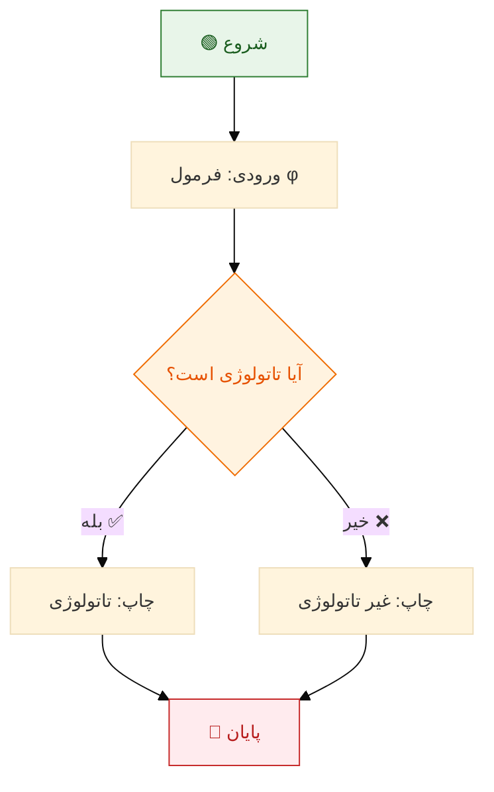
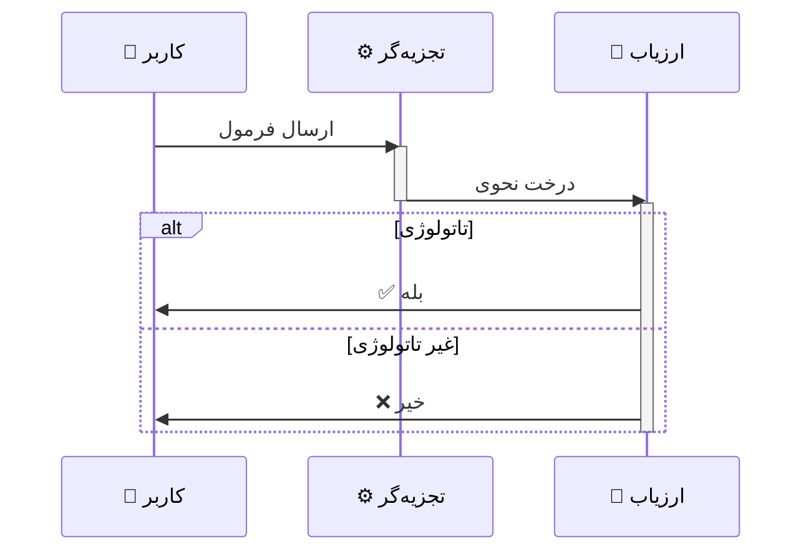
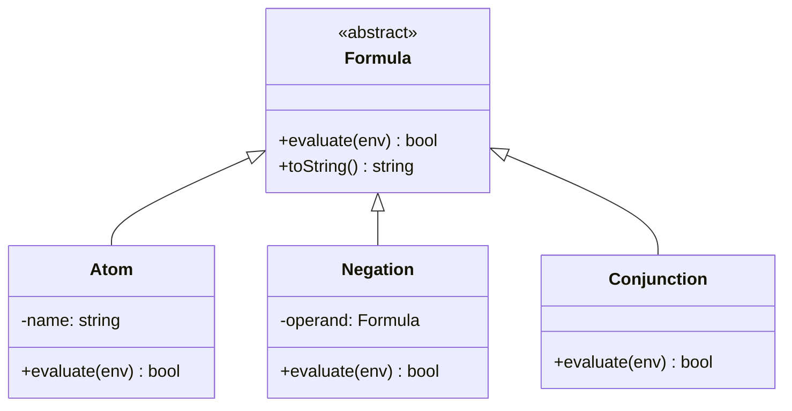
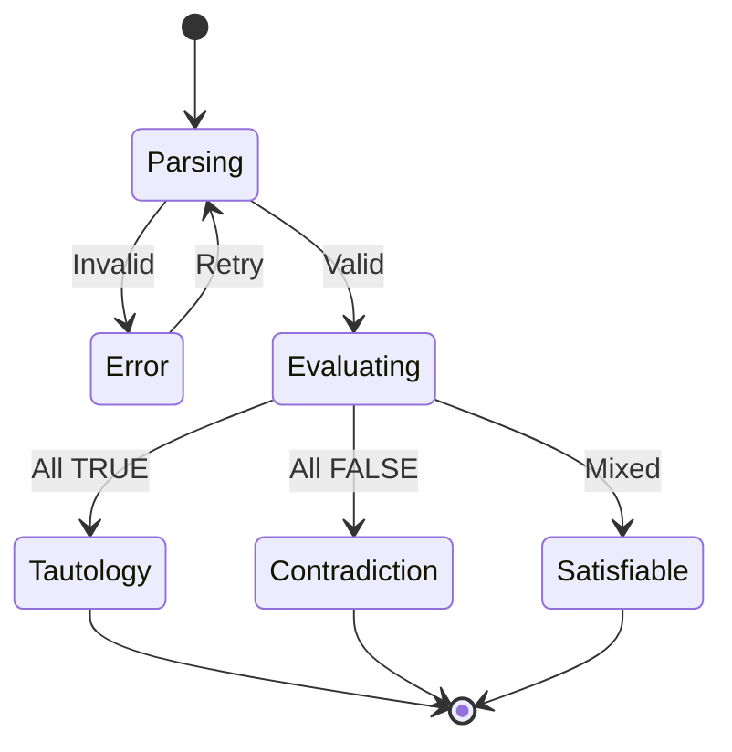
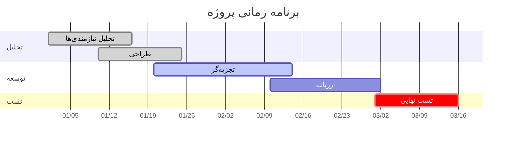
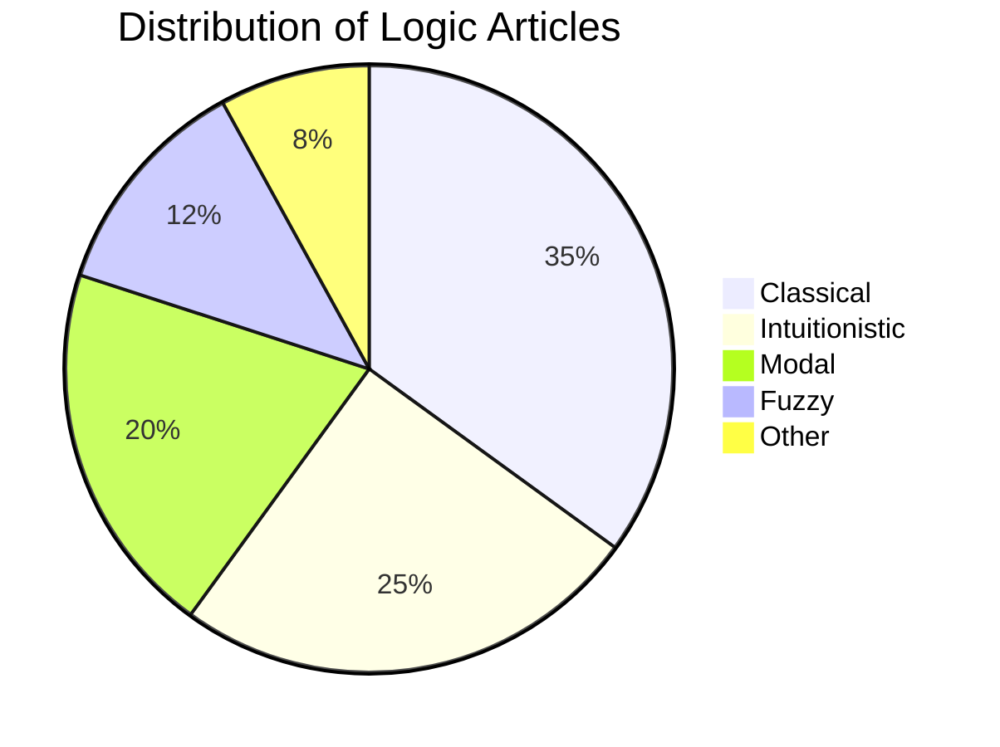
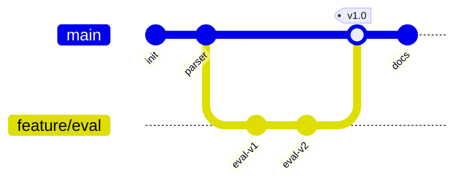
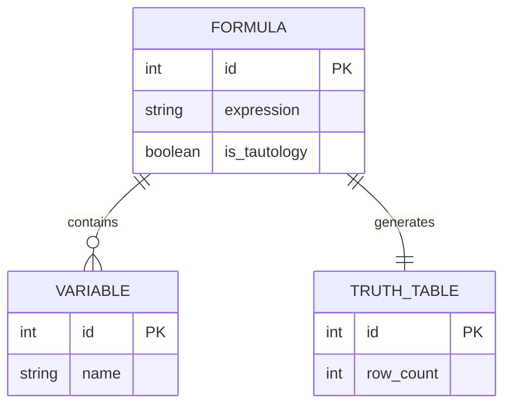

---
title: مبانی منطق ریاضی — نمونه تست تبدیل HTML به MDX
slug: html-mdx
date: '2026-02-20'
lang: fa
dir: rtl
type: article
tags: []
categories: []
description: ''
keywords: []
toc: true
math: false
mermaid: true
codeHighlight: true
sourceFormat: html
sourceFile: sample-page.html
assets:
  images: []
  files: []
noindex: false
converterVersion: 0.1.0
qualityScore: 0.0
convertedAt: '2026-02-20T04:01:19.913745+00:00'
---

import Details from '@/components/ui/Details';
import Figure from '@/components/media/Figure';

{/* ==========================================
         هدر و عنوان
    ========================================== */}


# 
 مبانی منطق ریاضی و اثبات‌های صوری
 


Foundations of Mathematical Logic and Formal Proofs


منطق
ریاضی
اثبات


نویسنده: **مهدی سالم** — تابستان ۱۴۰۴


---


{/* ==========================================
         فهرست مطالب
    ========================================== */}


## 📑 فهرست مطالب


- [۱. مقدمه و مفاهیم پایه](#chap1)


  - [۱.۱ تعاریف](#sec-def)
  - [۱.۲ قضایا و اثبات](#sec-theorem)
- [۲. جدول ارزش و عملگرها](#chap2)
- [۳. نمودارها](#chap3)
- [۴. تصاویر و چندرسانه‌ای](#chap4)
- [۵. کد و الگوریتم](#chap5)
- [۶. عناصر HTML خاص](#chap6)
- [۷. محتوای دوزبانه](#chap7)
- [۸. فرمول‌های پیشرفته](#chap8)
- [پانوشت‌ها](#chap-footnotes)
- [کتاب‌نامه](#chap-bib)


---


{/* ==========================================
         فصل ۱: مقدمه
    ========================================== */}


## ۱. مقدمه و مفاهیم پایه


این سند به‌عنوان یک **نمونه جامع تست** طراحی شده
 و شامل تمامی اجزای یک صفحه وب حرفه‌ای فارسی است.
 هدف آن تست تبدیل <abbr title="HyperText Markup Language">HTML</abbr>
 به <abbr title="Markdown + JSX">MDX</abbr> می‌باشد.


📌 نکته


 تمامی ارجاعات، پانوشت‌ها و کتاب‌نامه این سند
 صرفاً جهت تست هستند.


{/* === تعاریف === */}


### ۱.۱ تعاریف {#sec-def}


تعریف ۱.۱ — گزاره (Proposition)


**گزاره** جمله‌ای خبری است که دقیقاً یکی از
 دو ارزش «درست» (True, $\top$)
 یا «نادرست» (False, $\bot$) را دارد.


تعریف ۱.۲ — تاتولوژی (Tautology)


گزاره مرکب $\varphi$ یک **تاتولوژی** است
 اگر و تنها اگر تحت هر تخصیص ارزش، مقدار آن درست باشد:


 $$\models \varphi \iff \forall\, v : v(\varphi) = \top$$


{/* === قضیه و اثبات === */}


### ۱.۲ قضایا و اثبات {#sec-theorem}


قضیه ۱.۱ — قانون دمورگان (De Morgan's Laws)


برای هر دو گزاره $p$ و $q$:


 $$\neg(p \land q) \equiv (\neg p) \lor (\neg q)$$
 $$\neg(p \lor q) \equiv (\neg p) \land (\neg q)$$


اثبات قضیه ۱.۱


اثبات را با جدول ارزش انجام می‌دهیم. جدول کامل در
 [جدول ۱](#tab-demorgan) آمده است.
 با بررسی تمامی حالات، ستون‌های مربوطه برابرند. ∎


مثال ۱.۱ — کاربرد دمورگان


فرض کنید $p$: «هوا بارانی است» و $q$: «هوا سرد است».
 آنگاه:


 $$\neg(p \land q) \equiv \text{«هوا بارانی نیست \textbf{یا} سرد نیست»}$$


قضیه ۱.۲ — اصل طرد شق ثالث


برای هر گزاره $p$:
 $\models p \lor \neg p$
 <sup>[[۱]](#fn1)</sup>


اثبات قضیه ۱.۲


- اگر $p = \top$: $p \lor \neg p = \top \lor \bot = \top$ ✅
- اگر $p = \bot$: $p \lor \neg p = \bot \lor \top = \top$ ✅


پس در هر دو حالت مقدار درست است. ∎


---


{/* ==========================================
         فصل ۲: جدول ارزش
    ========================================== */}


## ۲. جدول ارزش و عملگرها


### جدول ارزش دمورگان


*جدول ۱ — جدول ارزش قوانین دمورگان*


| $p$ | $q$ | $p \land q$ | $\neg(p \land q)$ | $\neg p$ | $\neg q$ | $(\neg p)\lor(\neg q)$ | برابر؟ |
| --- | --- | ----------- | ----------------- | -------- | -------- | ---------------------- | ------ |
| T | T | T | F | F | F | F | ✅ |
| T | F | F | T | F | T | T | ✅ |
| F | T | F | T | T | F | T | ✅ |
| F | F | F | T | T | T | T | ✅ |


### جدول عملگرهای منطقی


*جدول ۲ — عملگرهای منطقی پایه*


| عملگر | نماد | نام انگلیسی | مثال |
| ----- | ---- | ----------- | ---- |
| نقیض | $\neg$ | Negation | $\neg p$ |
| عطف | $\land$ | Conjunction | $p \land q$ |
| فصل | $\lor$ | Disjunction | $p \lor q$ |
| شرطی | $\to$ | Implication | $p \to q$ |
| دوشرطی | $\leftrightarrow$ | Biconditional | $p \leftrightarrow q$ |


{/* جدول colSpan و rowSpan */}


### جدول با ادغام سلول (colspan / rowspan)


<div style={{overflowX: 'auto'}}>
<table>
<caption>جدول ۳ — مقایسه سیستم‌های اثبات</caption>
<thead>
<tr>
<th rowSpan={2}>سیستم</th>
<th colSpan={2}>ویژگی‌ها</th>
<th rowSpan={2}>کاربرد</th>
</tr>
<tr>
<th>تمامیت</th>
<th>سازگاری</th>
</tr>
</thead>
<tbody>
<tr>
<td>هیلبرت</td>
<td>✅</td>
<td>✅</td>
<td>مبانی نظری</td>
</tr>
<tr>
<td>استنتاج طبیعی</td>
<td>✅</td>
<td>✅</td>
<td>آموزش</td>
</tr>
<tr>
<td>تابلو</td>
<td>✅</td>
<td>✅</td>
<td>اثبات خودکار</td>
</tr>
<tr>
<td>رزولوشن</td>
<td>✅*</td>
<td>✅</td>
<td>SAT Solvers</td>
</tr>
</tbody>
<tfoot>
<tr>
<td colSpan={4}>*فقط برای فرم نرمال عطفی (CNF)</td>
</tr>
</tfoot>
</table>
</div>


{/* Definition List */}


### واژه‌نامه (Definition List)


****تاتولوژی** (Tautology)**

:   گزاره‌ای مرکب که تحت هر تخصیص ارزش، درست است.

****تناقض** (Contradiction)**

:   گزاره‌ای مرکب که تحت هر تخصیص ارزش، نادرست است.

****اقناع‌پذیر** (Satisfiable)**

:   گزاره‌ای مرکب که حداقل یک تخصیص ارزش وجود دارد که آن را درست کند.


---


{/* ==========================================
         فصل ۳: نمودارها (Mermaid)
    ========================================== */}


## ۳. نمودارها


### ۳.۱ فلوچارت فارسی





### ۳.۲ نمودار ترتیبی





### ۳.۳ نمودار کلاسی





### ۳.۴ نمودار وضعیت





### ۳.۵ نمودار گانت





### ۳.۶ نمودار دایره‌ای





### ۳.۷ نمودار Git





### ۳.۸ نمودار ER





---


{/* ==========================================
         فصل ۴: تصاویر و چندرسانه‌ای
    ========================================== */}


## ۴. تصاویر و چندرسانه‌ای


### ۴.۱ تصویر ساده


<Figure caption="شکل ۱ — نمودار مفهومی منطق ریاضی">

<Image src="https://via.placeholder.com/700x300/1A73E8/FFFFFF?text=Mathematical+Logic+Diagram" alt="نمودار منطق ریاضی" width={700} height={300} />

</Figure>


### ۴.۲ تصویر کنار متن (Float)


<Figure caption="شکل ۲ — نقشه ذهنی">

<Image src="https://via.placeholder.com/250x250/00897B/FFFFFF?text=Mind+Map" alt="نقشه ذهنی" width={250} height={250} />

</Figure>


این متن در کنار تصویر قرار گرفته تا نحوه عملکرد
 تصاویر شناور (`float`) را نشان دهد.
 در تبدیل به MDX این نوع چیدمان باید حفظ یا
 به شکل مناسبی بازنمایی شود.
 لورم ایپسوم متن ساختگی با تولید سادگی نامفهوم
 از صنعت چاپ و با استفاده از طراحان گرافیک است.
 چاپگرها

ادامه فایل HTML (از بخش تصاویر شناور):

```html
 و متون بلکه روزنامه و مجله در ستون و سطرآنچنان که
 لازم است و برای شرایط فعلی تکنولوژی مورد نیاز و
 کاربردهای متنوع با هدف بهبود ابزارهای کاربردی می‌باشد.
 کتاب‌های زیادی در شصت و سه درصد گذشته، حال و آینده
 شناخت فراوان جامعه و متخصصان را می‌طلبد.


### ۴.۳ تصویر با لینک


<Figure caption="شکل ۳ — کلیک کنید تا به ویکی‌پدیا بروید">

[
<Image src="https://via.placeholder.com/500x200/FB8C00/FFFFFF?text=Click+to+visit+Wikipedia" alt="لینک به ویکی‌پدیا — منطق ریاضی" width={500} height={200} />
](https://en.wikipedia.org/wiki/Mathematical_logic)

</Figure>


### ۴.۴ تصاویر کنار هم (Gallery)


<Figure caption="(الف) تابع میرا">

<Image src="https://via.placeholder.com/300x200/1A73E8/FFFFFF?text=Subfig+1" alt="زیرشکل ۱" />

</Figure>


<Figure caption="(ب) تابع سیگموید">

<Image src="https://via.placeholder.com/300x200/00897B/FFFFFF?text=Subfig+2" alt="زیرشکل ۲" />

</Figure>


### ۴.۵ ویدئو (Embed)


<Figure caption="ویدئو ۱ — ویدئوی نمونه (YouTube Embed)">

<Embed src="https://www.youtube-nocookie.com/embed/dQw4w9WgXcQ" title="ویدئوی نمونه" />

</Figure>


### ۴.۶ صوت (Audio)


<Figure caption="صوت ۱ — فایل صوتی نمونه">

<Audio src="https://www.soundhelix.com/examples/mp3/SoundHelix-Song-1.mp3" controls={true} />

</Figure>


### ۴.۷ SVG درون‌خطی


<Figure caption="شکل ۴ — نمودار ون SVG درون‌خطی">

<Image src="./sample-page-svg-1-5d062813.svg" alt="SVG figure 1" />

</Figure>


---


{/* ==========================================
         فصل ۵: کد و الگوریتم
    ========================================== */}


## ۵. کد و الگوریتم


### ۵.۱ بلوک کد Python


```python
from itertools import product

def is_tautology(formula, variables):
    """Check if a propositional formula is a tautology."""
    for values in product([True, False], repeat=len(variables)):
        env = dict(zip(variables, values))
        if not formula(env):
            return False
    return True

# Example: p ∨ ¬p (Law of Excluded Middle)
result = is_tautology(
    lambda e: e['p'] or (not e['p']),
    ['p']
)
print(f"p ∨ ¬p is tautology: {result}")  # True
```


### ۵.۲ بلوک کد JavaScript


```javascript
// De Morgan's Law verification
function verifyDeMorgan(p, q) {
  const left  = !(p && q);
  const right = (!p) || (!q);
  return left === right;
}

// Test all cases
for (const p of [true, false]) {
  for (const q of [true, false]) {
    console.log(`p=${p}, q=${q}: ${verifyDeMorgan(p, q)}`);
  }
}
```


### ۵.۳ بلوک کد LaTeX


```latex
\begin{theorem}{قانون دمورگان}{demorgan}
  برای هر دو گزاره $p$ و $q$:
  $$
\begin{aligned}
\neg(p \land q) &\equiv (\neg p) \lor (\neg q) \\
    \neg(p \lor q)  &\equiv (\neg p) \land (\neg q)
\end{aligned}
$$
\end{theorem}
```


### ۵.۴ بلوک کد Bash


```bash
# Compile LaTeX document
xelatex -interaction=nonstopmode document.tex
biber document
xelatex -interaction=nonstopmode document.tex
xelatex -interaction=nonstopmode document.tex

# Or with latexmk (recommended)
latexmk -xelatex document.tex
```


### ۵.۵ بلوک کد CSS


```css
/* RTL Support for Persian Content */
html[dir="rtl"] {
  font-family: 'Vazirmatn', 'Tahoma', sans-serif;
  line-height: 1.8;
  text-align: right;
}

html[dir="rtl"] blockquote {
  border-right: 4px solid #1A73E8;
  border-left: none;
  padding-right: 16px;
}

/* Mermaid diagrams always LTR */
.mermaid {
  direction: ltr;
  text-align: center;
}
```


### ۵.۶ کد درون‌خطی


از تابع `is_tautology()` برای بررسی تاتولوژی
 استفاده کنید. خروجی آن `True` یا
 `False` است.
 فایل اصلی در مسیر `src/logic/evaluator.py`
 قرار دارد.


### ۵.۷ شبه‌کد الگوریتم


الگوریتم ۱ — بررسی تاتولوژی با شمارش کامل


```

ورودی: فرمول گزاره‌ای φ با n متغیر
خروجی: آیا φ تاتولوژی است؟

برای i از ۰ تا 2ⁿ − 1 انجام بده:
    v ← تخصیص ارزش متناظر با i
    اگر Eval(φ, v) = ⊥ آنگاه:
        برگردان «خیر»
برگردان «بله»
```


---


{/* ==========================================
         فصل ۶: عناصر HTML خاص
    ========================================== */}


## ۶. عناصر HTML خاص


### ۶.۱ بلوک تاشو (Details / Summary)


<Details summary="جزئیات اثبات قانون دمورگان (کلیک کنید)">

اثبات از طریق جدول ارزش: هر چهار حالت ممکن را بررسی می‌کنیم.


 $$\neg(p \land q) \equiv (\neg p) \lor (\neg q)$$
 

| $p$ | $q$ | چپ | راست | برابر؟ |
| --- | --- | --- | ---- | ------ |
| T | T | F | F | ✅ |
| T | F | T | T | ✅ |
| F | T | T | T | ✅ |
| F | F | T | T | ✅ |


تمامی ستون‌ها برابرند. ∎

</Details>


<Details summary="📚 منابع بیشتر">

- [ویکی‌پدیا — قوانین دمورگان](https://en.wikipedia.org/wiki/De_Morgan%27s_laws)
- [Stanford Encyclopedia — Classical Logic](https://plato.stanford.edu/entries/logic-classical/)

</Details>


### ۶.۲ هایلایت و علامت‌گذاری


این یک <mark>متن هایلایت‌شده</mark> است.
 این یک متن <ins>اضافه‌شده (inserted)</ins> و
 این یک متن ~~حذف‌شده (deleted)~~ است.
 این یک متن کوچک و
 این <sup>بالانوشت</sup> و این <sub>زیرنوشت</sub> است.


### ۶.۳ کیبورد و متغیر


برای نیم‌فاصله در ویندوز: <kbd>Shift</kbd> + <kbd>Space</kbd>
\

 برای کامپایل: <kbd>Ctrl</kbd> + <kbd>Shift</kbd> + <kbd>B</kbd>
\

 متغیر ریاضی: `x` = `y` + `z`


### ۶.۴ آدرس و زمان


<address>
 نویسنده: [مهدی سالم](mailto:ali@example.com)\

 دانشگاه تهران، دانشکده ریاضی\

 تهران، ایران
 </address>


تاریخ انتشار:
 <time dateTime="2025-07-13">۲۲ تیر ۱۴۰۴</time>
 — آخرین ویرایش:
 <time dateTime="2025-07-13T15:30:00+03:30">ساعت ۱۵:۳۰</time>


### ۶.۵ نوار پیشرفت (Progress)


پیشرفت پروژه:
 <progress value={72} max={100}>72%</progress>
 ۷۲٪


تکمیل تست‌ها:
 <meter value={0.85} min={0} max={1}>85%</meter>
 ۸۵٪


### ۶.۶ جعبه‌های هشدار (Admonitions)


📌 نکته


در MDX معمولاً از کامپوننت‌های سفارشی برای Admonition استفاده می‌شود.


⚠ هشدار


فونت فارسی در نمودارهای Mermaid ممکن است در برخی
 مرورگرها به‌درستی نمایش داده نشود.


🚫 احتیاط


قبل از تبدیل، مطمئن شوید که encoding فایل
 `UTF-8 with BOM` است.


💡 راهنمایی


برای رندر ریاضیات در MDX، از KaTeX یا MathJax استفاده کنید.


### ۶.۷ لیست وظایف


- ☑️ نوشتن تعاریف پایه
- ☑️ اثبات قضیه دمورگان
- ⬜ اثبات قضیه تمامیت گودل
- ⬜ بازبینی نهایی


### ۶.۸ نقل‌قول تو در تو


> «منطق آغاز خرد است، نه پایان آن.» — اسپاک
>
>
>
>
> > **قضیه ناتمامیت گودل:**
> >  در هر سیستم صوری سازگار که به‌اندازه کافی قوی باشد،
> >  گزاره‌هایی وجود دارند که نه اثبات‌پذیرند و نه ابطال‌پذیر.
> >
> >
> >
> >
> > > این قضیه در سال ۱۹۳۱ توسط **کورت گودل**
> > >  منتشر شد.
> > >  <sup>[[۲]](#fn2)</sup>


### ۶.۹ Ordered List با انواع مختلف


#### عددی


1. تعریف مسئله
2. فرموله‌سازی
3. اثبات


#### حروف لاتین


1. روش مستقیم
2. روش برهان خلف
3. روش استقراء


#### رومی


1. مقدمه
2. بدنه اصلی
3. نتیجه‌گیری


### ۶.۱۰ فرم (برای تست تبدیل عنصر)


{/* Form: action=, method=GET */}
{/* TODO: Replace with appropriate form component */}


---


{/* ==========================================
         فصل ۷: محتوای دوزبانه
    ========================================== */}


## ۷. محتوای دوزبانه


### ۷.۱ پاراگراف ترکیبی فارسی-انگلیسی


در منطق ریاضی (Mathematical Logic)،
 یک **گزاره**
 (Proposition)
 جمله‌ای خبری است که دقیقاً یکی از دو ارزش
 **درست**
 (True, $\top$)
 یا **نادرست**
 (False, $\bot$)
 را دارد. این مفهوم پایه‌ای‌ترین واحد در
 **منطق گزاره‌ای**
 (Propositional Logic) است.


### ۷.۲ بلوک کامل انگلیسی درون سند فارسی


<div dir="ltr" lang="en">

#### 
 Definition (Tautology)
 


A compound proposition $\varphi$ is a **tautology**
 if and only if it evaluates to **true** under
 every possible truth assignment:


 $$\models \varphi \iff \forall\, v : v(\varphi) = \top$$
 

**Example:** $p \lor \neg p$ is a tautology
 (Law of Excluded Middle).

</div>


### ۷.۳ بلوک کامل انگلیسی — اثبات


<div dir="ltr" lang="en">

#### 
 Proof (De Morgan's First Law)
 


We need to show: $\neg(p \land q) \equiv (\neg p) \lor (\neg q)$


**Forward direction ($\Rightarrow$):**


Assume $\neg(p \land q)$. For contradiction, suppose
 $\neg[(\neg p) \lor (\neg q)]$, i.e., $p \land q$.
 This contradicts our assumption.


**Backward direction ($\Leftarrow$):**


Assume $(\neg p) \lor (\neg q)$. If $p \land q$, then both
 $p$ and $q$ hold, contradicting $\neg p$ or $\neg q$. ∎

</div>


### ۷.۴ جدول دوزبانه


*جدول ۴ — واژه‌نامه فارسی-انگلیسی*


| فارسی | English | نماد | توضیح |
| ----- | ------- | ---- | ----- |
| گزاره | Proposition | $p, q, r$ | جمله خبری با ارزش درست/نادرست |
| تاتولوژی | Tautology | $\top$ | همیشه درست |
| تناقض | Contradiction | $\bot$ | همیشه نادرست |
| سور عمومی | Universal Quantifier | $\forall$ | برای همه |
| سور وجودی | Existential Quantifier | $\exists$ | وجود دارد |


---


{/* ==========================================
         فصل ۸: فرمول‌های پیشرفته
    ========================================== */}


## ۸. فرمول‌های پیشرفته ریاضی


### ۸.۱ ماتریس


 $$
 A = \begin{pmatrix}
 a_{11} & a_{12} & \cdots & a_{1n} \\
 a_{21} & a_{22} & \cdots & a_{2n} \\
 \vdots & \vdots & \ddots & \vdots \\
 a_{m1} & a_{m2} & \cdots & a_{mn}
 \end{pmatrix}
 ,\qquad
 \vec{x} = \begin{pmatrix} x_1 \\ x_2 \\ \vdots \\ x_n \end{pmatrix}
 $$

 

### ۸.۲ مجموع و انتگرال


 $$
 \sum_{k=0}^{\infty} \frac{x^k}{k!} = e^x
 ,\qquad
 \int_{-\infty}^{+\infty} e^{-x^2}\,dx = \sqrt{\pi}
 $$

 

### ۸.۳ فرمول‌های فیزیک (معادلات ماکسول)


 $$
 \begin{aligned}
 \nabla \cdot \mathbf{E} &= \frac{\rho}{\epsilon_0}
 &\quad& \text{(قانون گاوس)} \\
 \nabla \cdot \mathbf{B} &= 0
 &\quad& \text{(نبود تک‌قطبی مغناطیسی)} \\
 \nabla \times \mathbf{E} &= -\frac{\partial \mathbf{B}}{\partial t}
 &\quad& \text{(قانون فاراده)} \\
 \nabla \times \mathbf{B} &= \mu_0 \mathbf{J}
 + \mu_0 \epsilon_0 \frac{\partial \mathbf{E}}{\partial t}
 &\quad& \text{(قانون آمپر-ماکسول)}
 \end{aligned}
 $$

 

### ۸.۴ حالت‌ها (Cases)


 $$
 |x| = \begin{cases}
 x & \text{اگر } x \geq 0 \\
 -x & \text{اگر } x < 0
 \end{cases}
 $$

 

### ۸.۵ استقراء ریاضی


**قضیه:** $\displaystyle\sum_{k=1}^{n} k = \frac{n(n+1)}{2}$


**پایه:**


 $$\sum_{k=1}^{1} k = 1 = \frac{1 \cdot 2}{2} \;\checkmark$$

 

**گام استقراء:**


 $$
 \begin{aligned}
 \sum_{k=1}^{m+1} k
 &= \left(\sum_{k=1}^{m} k\right) + (m+1) \\
 &= \frac{m(m+1)}{2} + (m+1) \\
 &= \frac{(m+1)(m+2)}{2} \quad\blacksquare
 \end{aligned}
 $$

 

### ۸.۶ زنجیره استدلال


اثبات: $\{p \to q,\; q \to r\} \vdash p \to r$


| خط | فرمول | توجیه |
| --- | ----- | ----- |
| ۱ | $p \to q$ | فرض |
| ۲ | $q \to r$ | فرض |
| ۳ | $p$ | فرض (برای معرفی شرطی) |
| ۴ | $q$ | حذف شرطی: ۱، ۳ |
| ۵ | $r$ | حذف شرطی: ۲، ۴ |
| ۶ | $p \to r$ | معرفی شرطی: ۳–۵ ∎ |


### ۸.۷ فرمول‌های نظریه مجموعه‌ها


 $$
 \begin{aligned}
 A \cup B &= \{x \mid x \in A \lor x \in B\} \\
 A \cap B &= \{x \mid x \in A \land x \in B\} \\
 \mathcal{P}(A) &= \{S \mid S \subseteq A\} \\
 |A \cup B| &= |A| + |B| - |A \cap B|
 \end{aligned}
 $$

 

### ۸.۸ تابع زتای ریمان


 $$
 \zeta(s) = \sum_{n=1}^{\infty} \frac{1}{n^s}
 = \prod_{p \text{ prime}} \frac{1}{1 - p^{-s}}
 \qquad (\operatorname{Re}(s) > 1)
 $$

 

### ۸.۹ تعریف اپسیلون-دلتای حد


 $$
 \lim_{x \to a} f(x) = L
 \;\;\Longleftrightarrow\;\;
 \forall \epsilon > 0\;\;
 \exists \delta > 0\;\;
 \forall x\;\;
 \Big(0 < |x - a| < \delta \implies |f(x) - L| < \epsilon\Big)
 $$

 

### ۸.۱۰ فرمول درون‌خطی فارسی-انگلیسی


مطابق [قضیه ۱.۱](#thm-demorgan)،
 اگر $p$ بیانگر «هوا بارانی است» و $q$ بیانگر
 «هوا سرد است» باشد، آنگاه
 $\neg(p \land q)$ یعنی «*هوا بارانی و سرد نیست*»
 معادل است با
 $(\neg p) \lor (\neg q)$ یعنی
 «*هوا بارانی نیست **یا** سرد نیست*».


---


{/* ==========================================
         پانوشت‌ها
    ========================================== */}


## پانوشت‌ها


1. اصل طرد شق ثالث
 (Law of Excluded Middle)
 در منطق شهودی
 (Intuitionistic Logic)
 پذیرفته نیست. برای جزئیات بیشتر به مقاله گودل (۱۹۳۱) مراجعه کنید.
 [↩](#fnref1 "بازگشت")
2. Kurt Gödel,
 *"Über formal unentscheidbare Sätze der Principia
 Mathematica und verwandter Systeme I"*,
 Monatshefte für Mathematik und Physik,
 38: 173–198, 1931.
 [↩](#fnref2 "بازگشت")
3. نیم‌فاصله
 (Zero-Width Non-Joiner, U+200C)
 کاراکتری نامرئی است که در فارسی بین پیشوند/پسوند و ریشه
 قرار می‌گیرد: «می‌روم»، «کتاب‌ها».
 [↩](#fnref3 "بازگشت")


---


{/* ==========================================
         کتاب‌نامه
    ========================================== */}


## 📚 کتاب‌نامه


1. Knuth, D. E. (1997).
 *The Art of Computer Programming*,
 Vol. 1, 3rd ed. Addison-Wesley.
2. Gödel, K. (1931).
 *"Über formal unentscheidbare Sätze der Principia
 Mathematica und verwandter Systeme I"*.
 Monatshefte für Mathematik und Physik, 38, 173–198.
3. ابراهیمی، محمد (۱۳۹۹).
 *مبانی منطق ریاضی*.
 انتشارات دانشگاه تهران.
4. MDN Web Docs (2024).
 *"MathML"*.
 [
 developer.mozilla.org
 ](https://developer.mozilla.org/en-US/docs/Web/MathML).
 Accessed: 2024-12-01.
5. Rastikerdar, S. (2024).
 *"Vazirmatn Font"*.
 [
 github.com/rastikerdar/vazirmatn
 ](https://github.com/rastikerdar/vazirmatn).


---


{/* ==========================================
         پاصفحه
    ========================================== */}


✍️ نویسنده: مهدی سالم
  | 
 📅 تابستان ۱۴۰۴ — Summer 2025
  | 
 📜 مجوز:
 [MIT](https://opensource.org/licenses/MIT)


🔗 مخزن:
 [
 github.com/example/format-converter
 ](https://github.com/example/format-converter)


این سند صرفاً جهت تست تبدیل فرمت HTML → MDX تهیه شده است.


{/* /.container */}
