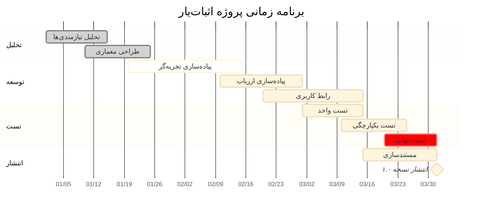
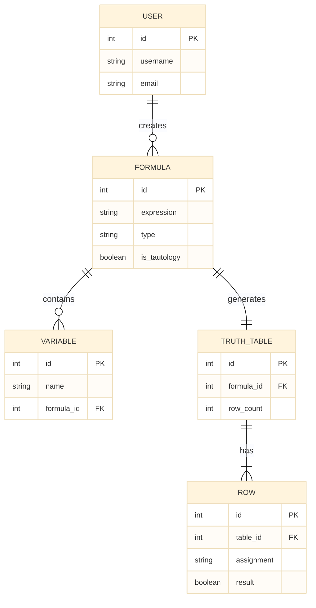
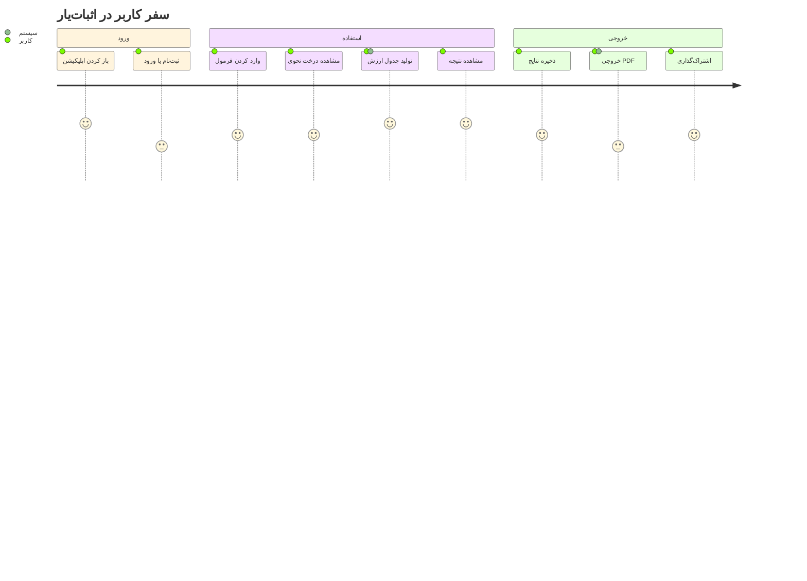
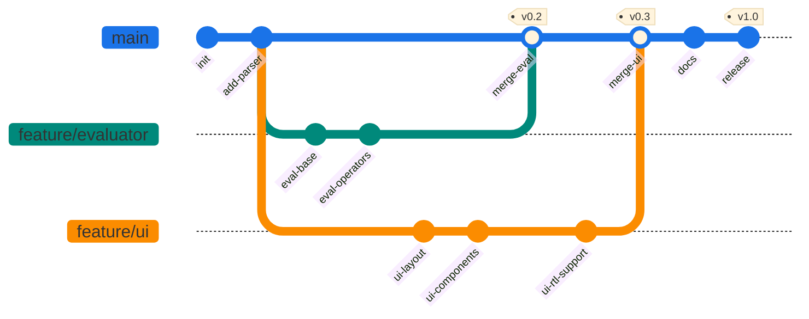
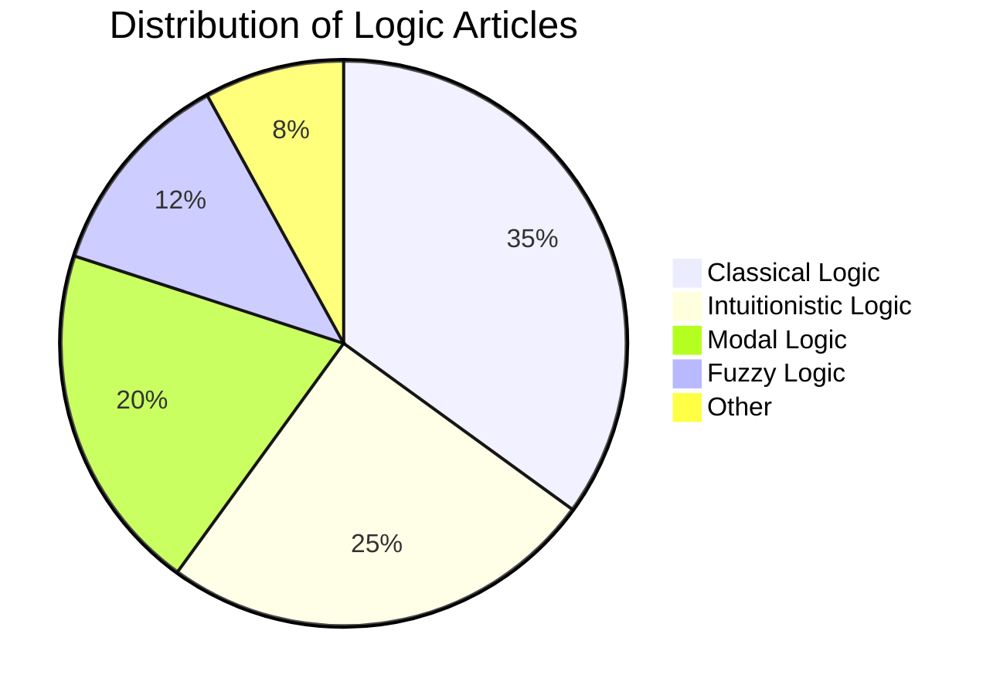
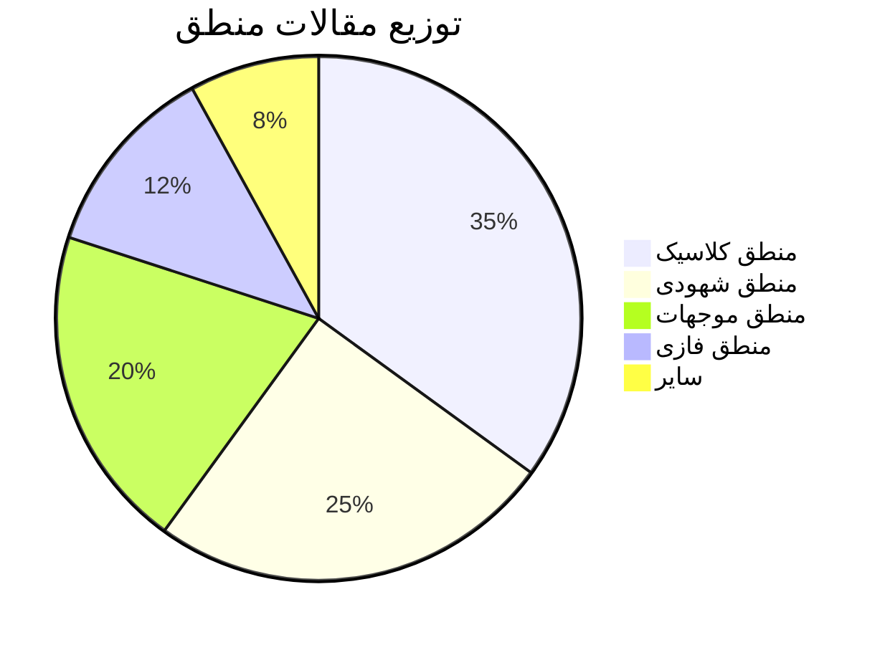
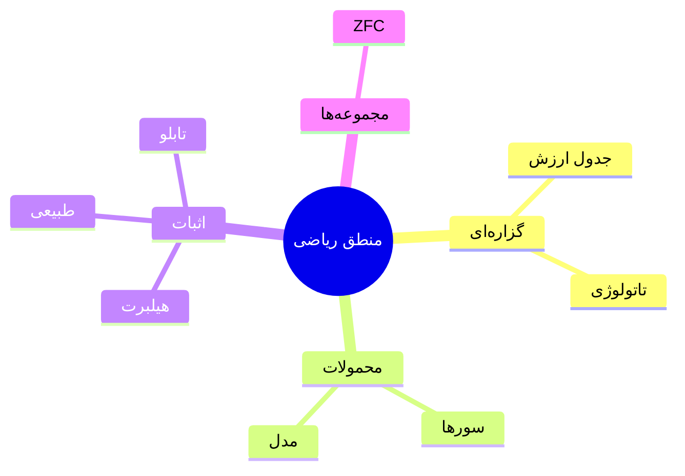
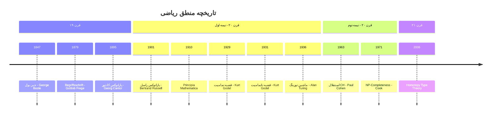
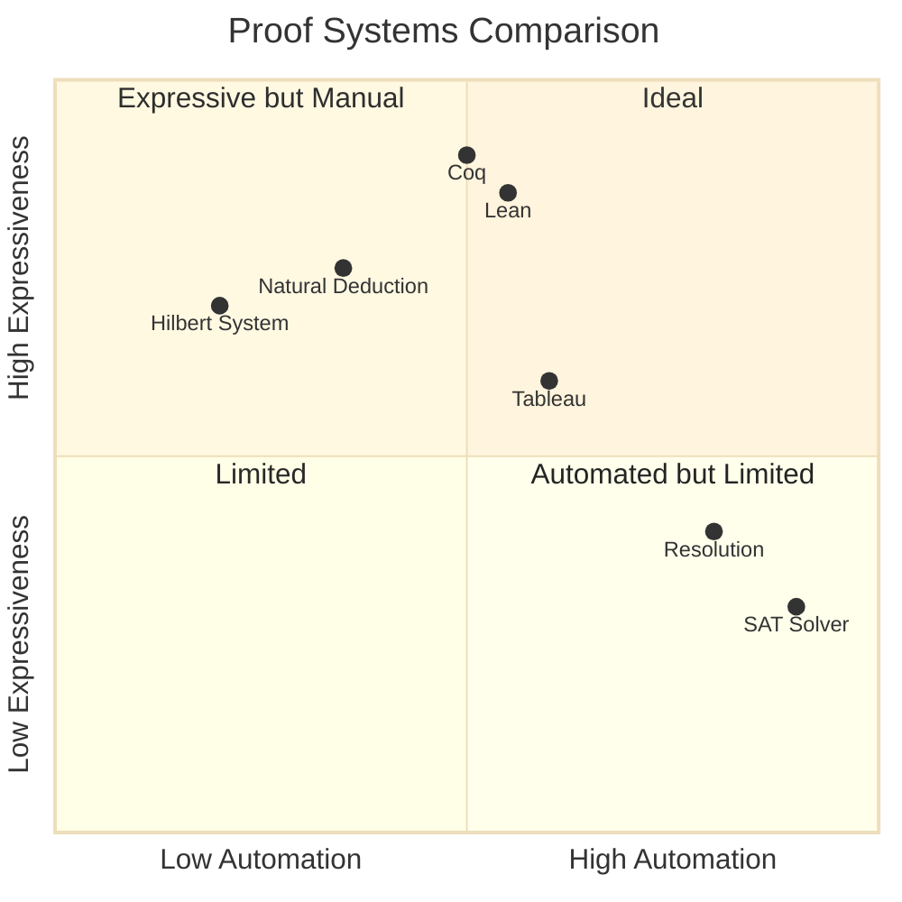
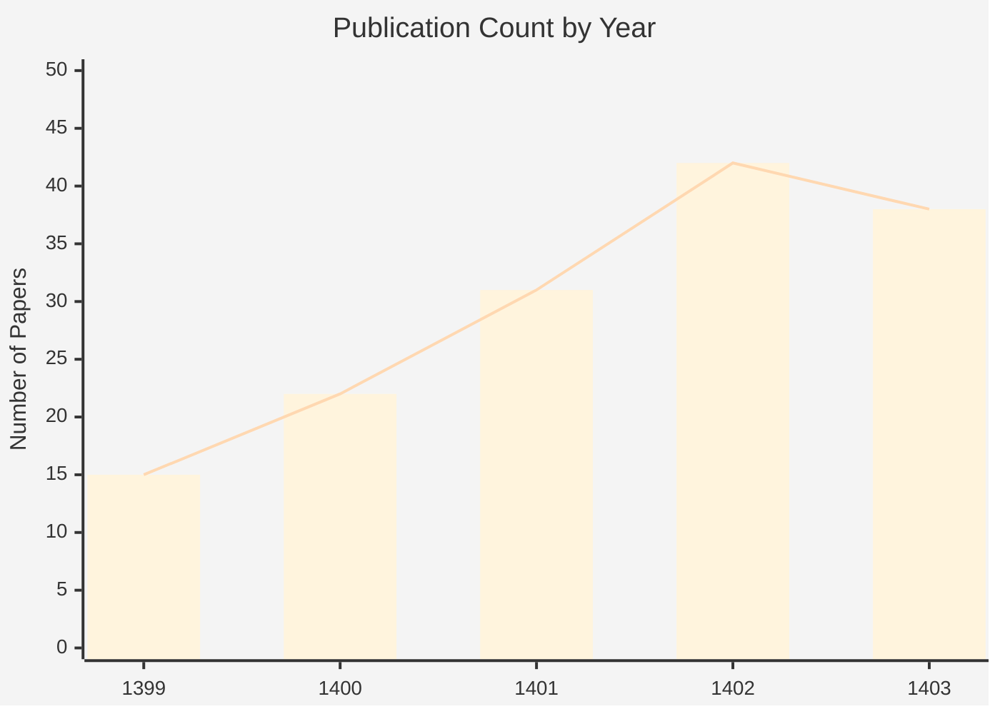

---
title: نمونه جامع مارک‌داون فارسی با نمودارهای Mermaid
slug: mermaid
date: '2025-07-13'
lang: fa
dir: rtl
type: article
tags: []
categories: []
description: فایل تست تبدیل فرمت MD به MDX
keywords: []
toc: true
math: true
mermaid: true
codeHighlight: true
sourceFormat: markdown
sourceFile: sample-mermaid.md
assets:
  images: []
  files: []
noindex: false
converterVersion: 0.1.0
qualityScore: 0.0
convertedAt: '2026-02-20T04:01:19.850472+00:00'
---

import Admonition from '@/components/ui/Admonition';
import Definition from '@/components/math/Definition';
import MermaidDiagram from '@/components/diagrams/MermaidDiagram';
import Proof from '@/components/math/Proof';
import Theorem from '@/components/math/Theorem';

---
dir: "rtl"
lang: "fa"
---

{/* ==========================================
  فایل نمونه جامع Markdown فارسی
  هدف: تست تبدیل به MDX
  شامل: تمامی انواع نمودار Mermaid + عناصر MD
========================================== */}

# ۱. مقدمه

این سند یک **نمونه جامع** مارک‌داون فارسی است که برای تست تبدیل فرمت به **MDX** طراحی شده است. در این سند تمامی انواع عناصر مارک‌داون و نمودارهای [Mermaid](https://mermaid.js.org/) پوشش داده شده‌اند.

> **💡 نکته: ** برای رندر صحیح فارسی در Mermaid، محدودیت‌هایی وجود دارد که در [بخش راهنمای فنی](#۱۰-راهنمای-فنی-مارکداون-فارسی-برای-وب) توضیح داده شده‌اند.

---

## ۱. ۱ قالب‌بندی متن

این یک **متن توپر (Bold)** است.
این یک *متن مورب (Italic)* است.
این یک ***متن توپر و مورب*** است.
این یک ~~متن خط‌خورده (Strikethrough)~~ است.
این یک `کد درون‌خطی (Inline Code)` است.
این یک [لینک به ویکی‌پدیا](https://fa.wikipedia.org) است.
این یک کلمه با زبان مبدأ انگلیسی: *Proposition* (گزاره) است.

## ۱. ۲ لیست‌ها

### لیست غیرمرتب

- منطق گزاره‌ای (Propositional Logic)
  - جدول ارزش
  - تاتولوژی و تناقض
- منطق محمولات (Predicate Logic)
  - سور عمومی $\forall$
  - سور وجودی $\exists$
- نظریه مجموعه‌ها
  - ZFC
  - نظریه نوع‌ها

### لیست مرتب

1. تعریف مسئله
2. فرموله‌سازی
3. اثبات
   4. روش مستقیم
   5. روش برهان خلف
   6. روش استقراء ریاضی
7. نتیجه‌گیری

### لیست وظایف (Task List)

- [x] نوشتن تعاریف پایه
- [x] اثبات قضیه دمورگان
- [ ] اثبات قضیه تمامیت گودل
- [ ] بازبینی نهایی

---

## ۱. ۳ نقل‌قول‌ها

> «منطق آغاز خرد است، نه پایان آن. »
> — اسپاک (Star Trek)

> **قضیه ناتمامیت گودل: **
> در هر سیستم صوری سازگار که به‌اندازه کافی قوی باشد،
> گزاره‌هایی وجود دارند که نه اثبات‌پذیرند و نه ابطال‌پذیر.
>
> > این قضیه در سال ۱۹۳۱ توسط **کورت گودل** (Kurt Gödel)
> > منتشر شد و بنیان ریاضیات را متحول کرد.

---

## ۱. ۴ جداول

### جدول ساده — عملگرهای منطقی

| عملگر | نماد | نام انگلیسی | مثال |
|: ------: |: ----: |: ------------|: -----|
| نقیض | $\neg$ | Negation | $\neg p$ |
| عطف | $\land$ | Conjunction | $p \land q$ |
| فصل | $\lor$ | Disjunction | $p \lor q$ |
| شرطی | $\to$ | Implication | $p \to q$ |
| دوشرطی | $\leftrightarrow$ | Biconditional | $p \leftrightarrow q$ |

### جدول ارزش دمورگان

| $p$ | $q$ | $p \land q$ | $\neg(p \land q)$ | $\neg p$ | $\neg q$ | $(\neg p) \lor (\neg q)$ | برابر؟ |
|: ---: |: ---: |: ---: |: ---: |: ---: |: ---: |: ---: |: ---: |
| T | T | T | **F** | F | F | **F** | ✅ |
| T | F | F | **T** | F | T | **T** | ✅ |
| F | T | F | **T** | T | F | **T** | ✅ |
| F | F | F | **T** | T | T | **T** | ✅ |

### جدول مقایسه‌ای — سیستم‌های اثبات

| سیستم | نوع | تمامیت | سازگاری | کاربرد اصلی |
|: ------|: ----|: ------: |: -------: |: -----------|
| هیلبرت (Hilbert) | اصل‌موضوعی | ✅ | ✅ | مبانی نظری |
| استنتاج طبیعی (Natural Deduction) | قاعده‌محور | ✅ | ✅ | آموزش و اثبات دستی |
| تابلو (Tableau) | درختی | ✅ | ✅ | اثبات خودکار |
| رزولوشن (Resolution) | مکانیزه | ✅* | ✅ | SAT Solvers |

*\*فقط برای فرم نرمال عطفی (CNF)*

---

## ۱. ۵ ریاضیات

### فرمول درون‌خطی

قانون دمورگان بیان می‌کند: $\neg(p \land q) \equiv (\neg p) \lor (\neg q)$

### فرمول بلوکی

<div dir="ltr">

$$
\neg \forall x\, P(x) \;\equiv\; \exists x\, \neg P(x)
$$

</div>

<div dir="ltr">

$$
\sum_{k=0}^{\infty} \frac{x^k}{k!} = e^x
$$

</div>

<div dir="ltr">

$$
\int_{-\infty}^{+\infty} e^{-x^2}\,dx = \sqrt{\pi}
$$

</div>

### ماتریس

<div dir="ltr">

$$
A = \begin{pmatrix}
a_{11} & a_{12} & \cdots & a_{1n} \\
a_{21} & a_{22} & \cdots & a_{2n} \\
\vdots & \vdots & \ddots & \vdots \\
a_{m1} & a_{m2} & \cdots & a_{mn}
\end{pmatrix}
$$

</div>

### فرمول چندخطی (Aligned)

<div dir="ltr">

$$
\begin{aligned}
\mathcal{L}\{f(t)\} &= \int_{0}^{\infty} e^{-st} f(t)\,dt \\
\hat{f}(\xi) &= \int_{-\infty}^{+\infty} f(x)\,e^{-2\pi i x\xi}\,dx \\
\nabla \times \mathbf{E} &= -\frac{\partial \mathbf{B}}{\partial t}
\end{aligned}
$$

</div>

### حالت‌ها (Cases)

<div dir="ltr">

$$
|x| = \begin{cases}
x & \text{if } x \geq 0 \\
-x & \text{if } x < 0
\end{cases}
$$

</div>

---

## ۱. ۶ کد

### کد درون‌خطی

از تابع `is_tautology()` برای بررسی تاتولوژی بودن استفاده کنید.

### بلوک کد Python

<div dir="ltr">

```python
from itertools import product

<div dir="ltr" lang="en">def is_tautology(formula, variables):
    """Check if a propositional formula is a tautology."""
    for values in product([True, False], repeat=len(variables)):
        env = dict(zip(variables, values))
        if not formula(env):
            return False
    return True</div>

<div dir="ltr" lang="en"># Example: p ∨ ¬p
result = is_tautology(
    lambda e: e['p'] or (not e['p']),
    ['p']
)
print(f"p ∨ ¬p is tautology: {result}")  # True
```</div>

</div>

### بلوک کد JavaScript

<div dir="ltr">

```javascript
// Evaluate a simple propositional formula
function evaluate(formula, env) {
  return formula(env);
}

<div dir="ltr" lang="en">// De Morgan's Law verification
const deMorgan = (env) => {
  const { p, q } = env;
  const left = !(p && q);
  const right = (!p) || (!q);
  return left === right;
};</div>

<div dir="ltr" lang="en">console.log(evaluate(deMorgan, { p: true, q: false })); // true
```</div>

</div>

### بلوک کد LaTeX

<div dir="ltr">

```latex
\begin{theorem}{قانون دمورگان}{demorgan}
  برای هر دو گزاره $p$ و $q$:
  <div dir="ltr">

$$
\begin{aligned}
\neg(p \land q) &\equiv (\neg p) \lor (\neg q) \\
    \neg(p \lor q)  &\equiv (\neg p) \land (\neg q)
\end{aligned}
$$

</div>
\end{theorem}
```

</div>

### بلوک کد با نشانه‌گذاری خط (Line Highlighting)

<div dir="ltr">

```python {1,3-5}
# خط ۱: ایمپورت
from itertools import product
# خط ۳-۵: تابع اصلی
def check(f, vars):
    return all(f(dict(zip(vars, v)))
               for v in product([True, False], repeat=len(vars)))
```

</div>

---

## ۱. ۷ تصاویر

### تصویر ساده

<Image src="https://via.placeholder.com/600x300/1A73E8/FFFFFF?text=Mathematical+Logic+Diagram "نمودار منطق ریاضی"" alt="نمودار منطق ریاضی" />

### تصویر با اندازه مشخص (در MDX)

{/* در MDX خالص: <Image src="..." width={600} height={300} alt="..." /> */}

<Image src="https://via.placeholder.com/400x400/00897B/FFFFFF?text=Mind+Map "نقشه ذهنی شاخه‌های منطق ریاضی"" alt="نقشه ذهنی منطق" />

---

## ۱. ۸ خطوط افقی و جداکننده‌ها

بخش قبلی

---

بخش بعدی

***

بخش پایانی

---

## ۱. ۹ HTML درون مارک‌داون

<div dir="rtl" style={{background: '#E3F2FD', padding: '16px', borderRight: '4px solid #1A73E8', borderRadius: '4px', margin: '16px 0'}}>
  <strong>📌 نکته مهم:</strong>
  این یک بلوک HTML درون مارک‌داون است که برای تست رندر HTML
  در تبدیل‌گر استفاده می‌شود. متن فارسی با
  <code>dir="rtl"</code>
  تنظیم شده است.
</div>

<details>
<summary><strong>جزئیات اثبات (کلیک کنید)</strong></summary>

این بخش یک عنصر تاشو (`details/summary`) است.
در اینجا می‌توان اثبات مفصلی قرار داد:

<div dir="ltr">

$$
\neg(p \land q) \equiv (\neg p) \lor (\neg q)
$$

</div>

**اثبات: ** با جدول ارزش تمامی ۴ حالت را بررسی می‌کنیم. ✅

</details>

<div dir="ltr" style={{background: '#FFF3E0', padding: '12px', borderLeft: '4px solid #FB8C00', borderRadius: '4px', margin: '16px 0'}}>
  <strong>⚠ Warning (English Block):</strong>
  This is a left-to-right HTML block inside a primarily RTL document,
  used to test bidirectional rendering in the MDX converter.
</div>

---

# ۲. نمودارهای Mermaid

> **⚠ محدودیت فارسی در Mermaid: **
> برخی انواع نمودارها (مانند Pie Chart و بعضی حالت‌های Mindmap) مشکلاتی با متن فارسی RTL دارند. در این موارد **راه‌حل‌ها** و **جایگزین‌ها** ذکر شده‌اند.

---

## ۲. ۱ فلوچارت (Flowchart) — فارسی

<div dir="ltr">

```mermaid
%%{init: {"theme": "base", "themeVariables": {"fontSize": "14px"}, "flowchart": {"htmlLabels": true}}}%%
flowchart TD
    A["🟢 شروع"] --> B["ورودی: فرمول φ"]
    B --> C{"آیا تاتولوژی است؟"}
    C -->|"بله ✅"| D["چاپ: تاتولوژی است"]
    C -->|"خیر ❌"| E["چاپ: تاتولوژی نیست"]
    D --> F["🔴 پایان"]
    E --> F

<div dir="ltr" lang="en">style A fill:#E8F5E9,stroke:#2E7D32,color:#1B5E20
    style F fill:#FFEBEE,stroke:#C62828,color:#B71C1C
    style C fill:#FFF3E0,stroke:#EF6C00,color:#E65100
    style D fill:#E3F2FD,stroke:#1565C0,color:#0D47A1
    style E fill:#FCE4EC,stroke:#AD1457,color:#880E4F
```</div>

</div>

## ۲. ۲ فلوچارت (Flowchart) — انگلیسی

<div dir="ltr">

```mermaid
%%{init: {"theme": "base", "themeVariables": {"primaryColor": "#E3F2FD", "primaryTextColor": "#0D47A1", "primaryBorderColor": "#1565C0", "lineColor": "#1A73E8", "fontSize": "13px"}}}%%
flowchart LR
    A[Start] --> B[Input: Formula φ]
    B --> C{Is it a tautology?}
    C -->|Yes| D[Output: TRUE]
    C -->|No| E[Output: FALSE]
    D --> F[End]
    E --> F

<div dir="ltr" lang="en">style A fill:#C8E6C9,stroke:#388E3C
    style F fill:#FFCDD2,stroke:#D32F2F
```</div>

</div>

## ۲. ۳ نمودار ترتیبی (Sequence Diagram) — فارسی

<div dir="ltr">

```mermaid
%%{init: {"theme": "base", "themeVariables": {"fontSize": "13px"}, "sequence": {"mirrorActors": false}}}%%
sequenceDiagram
    participant U as 👤 کاربر
    participant P as ⚙️ تجزیه‌گر
    participant E as 🧮 ارزیاب
    participant R as 📊 نتیجه

    U->>P: ارسال فرمول «p ∧ q → p»
    activate P
    P->>P: تجزیه نحوی (Parsing)
    P->>E: درخت نحوی (AST)
    deactivate P
    activate E
    E->>E: تولید جدول ارزش
    E->>E: بررسی تمام حالات
    alt تاتولوژی است
        E->>R: ✅ تاتولوژی
    else تاتولوژی نیست
        E->>R: ❌ غیر تاتولوژی
    end
    deactivate E
    R->>U: نمایش نتیجه
    Note over U,R: فرآیند بررسی تاتولوژی کامل شد
```

</div>

## ۲. ۴ نمودار ترتیبی (Sequence Diagram) — انگلیسی

<div dir="ltr">

```mermaid
sequenceDiagram
    participant C as Client
    participant S as Server
    participant DB as Database

<div dir="ltr" lang="en">C->>S: POST /api/verify-formula
    activate S
    S->>DB: Query formula cache
    DB-->>S: Cache miss
    S->>S: Evaluate formula
    S-->>C: 200 OK {isTautology: true}
    deactivate S
```</div>

</div>

## ۲. ۵ نمودار کلاسی (Class Diagram)

<div dir="ltr">

```mermaid
%%{init: {"theme": "base", "themeVariables": {"fontSize": "13px"}}}%%
classDiagram
    class Formula {
        <<abstract>>
        +evaluate(env) bool
        +toString() string
        +getVariables() Set
    }

<div dir="ltr" lang="en">class Atom {
        -name: string
        +evaluate(env) bool
    }</div>

<div dir="ltr" lang="en">class Negation {
        -operand: Formula
        +evaluate(env) bool
    }</div>

<div dir="ltr" lang="en">class BinaryOp {
        <<abstract>>
        -left: Formula
        -right: Formula
    }</div>

<div dir="ltr" lang="en">class Conjunction {
        +evaluate(env) bool
    }</div>

<div dir="ltr" lang="en">class Disjunction {
        +evaluate(env) bool
    }</div>

<div dir="ltr" lang="en">class Implication {
        +evaluate(env) bool
    }</div>

<div dir="ltr" lang="en">class Biconditional {
        +evaluate(env) bool
    }</div>

<div dir="ltr" lang="en">class TruthTableGenerator {
        +generate(formula: Formula) Table
        +isTautology(formula: Formula) bool
        +isContradiction(formula: Formula) bool
    }</div>

<div dir="ltr" lang="en">Formula <|-- Atom
    Formula <|-- Negation
    Formula <|-- BinaryOp
    BinaryOp <|-- Conjunction
    BinaryOp <|-- Disjunction
    BinaryOp <|-- Implication
    BinaryOp <|-- Biconditional
    TruthTableGenerator ..> Formula : uses
```</div>

</div>

## ۲. ۶ نمودار وضعیت (State Diagram) — فارسی

<div dir="ltr">

```mermaid
%%{init: {"theme": "base", "themeVariables": {"fontSize": "13px"}}}%%
stateDiagram-v2
    [*] --> ورودی_فرمول
    ورودی_فرمول --> تجزیه_نحوی: دریافت فرمول
    تجزیه_نحوی --> خطای_نحوی: فرمول نامعتبر
    خطای_نحوی --> ورودی_فرمول: اصلاح
    تجزیه_نحوی --> ساخت_درخت: فرمول معتبر

    state ساخت_درخت {
        [*] --> تحلیل_عملگرها
        تحلیل_عملگرها --> ساخت_AST
        ساخت_AST --> [*]
    }

    ساخت_درخت --> ارزیابی
    ارزیابی --> تاتولوژی: همه TRUE
    ارزیابی --> تناقض: همه FALSE
    ارزیابی --> اقناع_پذیر: ترکیبی
    تاتولوژی --> [*]
    تناقض --> [*]
    اقناع_پذیر --> [*]
```

</div>

## ۲. ۷ نمودار گانت (Gantt Chart)

<div dir="ltr">



</div>

## ۲. ۸ نمودار ER (Entity Relationship)

<div dir="ltr">



</div>

## ۲. ۹ نمودار سفر کاربر (User Journey)

<div dir="ltr">



</div>

## ۲. ۱۰ نمودار Git Graph

<div dir="ltr">



</div>

## ۲. ۱۱ نمودار دایره‌ای (Pie Chart)

> **⚠ محدودیت فارسی: ** نمودار Pie در Mermaid با متن فارسی ممکن است مشکل رندر داشته باشد. در صورت بروز مشکل، از لیبل‌های انگلیسی استفاده کنید.

### نسخه انگلیسی (مطمئن)

<div dir="ltr">



</div>

### نسخه فارسی (ممکن است نیاز به تنظیم فونت داشته باشد)

<div dir="ltr">



</div>

## ۲. ۱۲ نمودار Requirement

<div dir="ltr">

```mermaid
%%{init: {"theme": "base"}}%%
requirementDiagram
    requirement TautologyCheck {
        id: REQ-001
        text: "System shall verify if a formula is a tautology"
        risk: low
        verifymethod: test
    }

<div dir="ltr" lang="en">functionalRequirement ParserReq {
        id: REQ-002
        text: "System shall parse propositional formulas"
        risk: medium
        verifymethod: test
    }</div>

<div dir="ltr" lang="en">element Evaluator {
        type: module
        docRef: "eval.py"
    }</div>

<div dir="ltr" lang="en">element Parser {
        type: module
        docRef: "parser.py"
    }</div>

<div dir="ltr" lang="en">Evaluator - satisfies -> TautologyCheck
    Parser - satisfies -> ParserReq
    TautologyCheck - derives -> ParserReq
```</div>

</div>

## ۲. ۱۳ نمودار C4 (معماری نرم‌افزار)

<div dir="ltr">

```mermaid
%%{init: {"theme": "base"}}%%
C4Context
    title System Context Diagram - Proof Assistant

<div dir="ltr" lang="en">Person(user, "User", "A mathematician or student who wants to verify logical formulas")</div>

<div dir="ltr" lang="en">System(proofAssistant, "Proof Assistant", "Verifies propositional and predicate logic formulas")</div>

<div dir="ltr" lang="en">System_Ext(latex, "LaTeX Engine", "Generates PDF output")
    System_Ext(mathjax, "MathJax", "Renders mathematical notation")</div>

<div dir="ltr" lang="en">Rel(user, proofAssistant, "Submits formulas", "HTTPS")
    Rel(proofAssistant, latex, "Sends LaTeX source", "API")
    Rel(proofAssistant, mathjax, "Renders math", "JS")
    Rel(user, proofAssistant, "Views results", "HTTPS")
```</div>

</div>

## ۲. ۱۴ نمودار Mindmap

> **⚠ محدودیت: ** Mindmap در Mermaid نسبتاً جدید است و ممکن است با متون فارسی مشکل داشته باشد.

### نسخه انگلیسی (مطمئن)

<div dir="ltr">

```mermaid
mindmap
  root((Mathematical Logic))
    Propositional
      Truth Tables
      Tautologies
      Normal Forms
        CNF
        DNF
    Predicate
      Quantifiers
      Models
      Completeness
    Proof Systems
      Hilbert
      Natural Deduction
      Tableau
      Resolution
    Set Theory
      ZFC
      Type Theory
    Computability
      Turing Machines
      Lambda Calculus
```

</div>

### نسخه فارسی (تجربی)

<div dir="ltr">



</div>

## ۲. ۱۵ نمودار Timeline

<div dir="ltr">



</div>

## ۲. ۱۶ نمودار Quadrant Chart

<div dir="ltr">



</div>

## ۲. ۱۷ نمودار XY Chart

<div dir="ltr">



</div>

## ۲. ۱۸ نمودار Block (تجربی)

<div dir="ltr">

```mermaid
block-beta
    columns 3
    A["ورودی فرمول"]:1
    B["تجزیه‌گر"]:1
    C["ارزیاب"]:1
    D["جدول ارزش"]:2
    E["نتیجه"]:1

<div dir="ltr" lang="en">A --> B
    B --> C
    C --> D
    D --> E
```</div>

</div>

---

# ۳. عناصر ترکیبی

## ۳. ۱ جدول + ریاضی + کد

| ردیف | فرمول | نتیجه | کد معادل |
|: ----: |: ------|: -----: |: ---------|
| ۱ | $p \lor \neg p$ | تاتولوژی ✅ | `p or (not p)` |
| ۲ | $p \land \neg p$ | تناقض ❌ | `p and (not p)` |
| ۳ | $p \to (q \to p)$ | تاتولوژی ✅ | `(not p) or ((not q) or p)` |
| ۴ | $(p \to q) \land (q \to r) \to (p \to r)$ | تاتولوژی ✅ | قانون تعدی |

## ۳. ۲ نقل‌قول تو در تو + ریاضی

> **قضیه (دمورگان): **
> برای هر $p, q$:
> <div dir="ltr">

$$\neg(p \land q) \equiv (\neg p) \lor (\neg q)$$

</div>
>
> > **اثبات: **
> > کافی است جدول ارزش هر چهار حالت ممکن را بسازیم.
> > در تمامی حالات، دو طرف هم‌ارز هستند. $\blacksquare$

---

# ۴. پاورقی‌ها (Footnotes)

منطق ریاضی[^1] شاخه‌ای از ریاضیات است که به مطالعه صوری استدلال می‌پردازد.

قضیه ناتمامیت گودل[^2] یکی از مهم‌ترین نتایج قرن بیستم است.

نیم‌فاصله[^3] در تایپ فارسی اهمیت زیادی دارد.

[^1]: Mathematical Logic — شاخه‌ای که در آن از زبان‌های صوری برای بیان و بررسی استدلال‌ها استفاده می‌شود.
[^2]: Kurt Gödel, "Über formal unentscheidbare Sätze der Principia Mathematica und verwandter Systeme I" (1931). این قضیه نشان می‌دهد که در هر سیستم صوری سازگار و به‌اندازه کافی قوی، گزاره‌های اثبات‌ناپذیر وجود دارند.
[^3]: نیم‌فاصله (Zero-Width Non-Joiner, U+200C) کاراکتری نامرئی است که در فارسی بین پیشوند/پسوند و ریشه قرار می‌گیرد: «می‌روم»، «کتاب‌ها»، «نمی‌دانم».

---

# ۵. تعریف واژگان (Definition List)

> **نکته: ** مارک‌داون استاندارد از Definition List پشتیبانی نمی‌کند، اما برخی تبدیل‌گرها (مانند `markdown-it-deflist`) آن را دارند.

تاتولوژی (Tautology): گزاره‌ای مرکب که تحت هر تخصیص ارزش، درست است.

تناقض (Contradiction): گزاره‌ای مرکب که تحت هر تخصیص ارزش، نادرست است.

اقناع‌پذیر (Satisfiable): گزاره‌ای مرکب که حداقل یک تخصیص ارزش وجود دارد که آن را درست کند.

---

# ۶. اختصارات و Emoji

| Emoji | معنی | کاربرد |
|: -----: |: -----|: -------|
| ✅ | درست / موفق | تاتولوژی |
| ❌ | نادرست / ناموفق | تناقض |
| ⚠️ | هشدار | محدودیت |
| 💡 | نکته | راهنمایی |
| 📌 | مهم | نکته حیاتی |
| 🔗 | لینک | ارجاع |
| 📊 | نمودار | آمار |
| 🧮 | محاسبه | ارزیابی |
| 📝 | یادداشت | توضیح |

---

# ۷. محتوای دوزبانه (Bilingual)

## ۷. ۱ پاراگراف ترکیبی

در منطق ریاضی (Mathematical Logic)، یک **گزاره** (Proposition) جمله‌ای خبری است که دقیقاً یکی از دو ارزش **درست** (True, $\top$) یا **نادرست** (False, $\bot$) را دارد. این مفهوم پایه‌ای‌ترین واحد در **منطق گزاره‌ای** (Propositional Logic) است.

## ۷. ۲ بلوک انگلیسی درون سند فارسی

<div dir="ltr" lang="en">

<div dir="ltr" lang="en">### Definition (Tautology)</div>

<div dir="ltr" lang="en">A compound proposition $\varphi$ is a **tautology** if and only if it evaluates to **true** under every possible truth assignment:</div>

<div dir="ltr">

$$
\models \varphi \iff \forall\, v : v(\varphi) = \top
$$

</div>

<div dir="ltr" lang="en">**Example: ** $p \lor \neg p$ is a tautology (Law of Excluded Middle).</div>

</div>

---

<div dir="ltr" lang="en"># ۸. Admonitions / Callouts</div>

<Admonition type="note">

**نکته: ** در MDX معمولاً از کامپوننت‌های سفارشی برای Admonition استفاده می‌شود. این بخش برای تست تبدیل این قالب‌هاست.

</Admonition>

<Admonition type="tip">

**راهنمایی: ** برای رندر صحیح ریاضیات در MDX، از KaTeX یا MathJax استفاده کنید.

</Admonition>

<Admonition type="warning">

**هشدار: ** فونت فارسی در نمودارهای Mermaid ممکن است در برخی مرورگرها به‌درستی نمایش داده نشود.

</Admonition>

<Admonition type="caution">

**احتیاط: ** قبل از تبدیل، مطمئن شوید که encoding فایل UTF-8 with BOM است.

</Admonition>

<Admonition type="important">

**مهم: ** بسته `xepersian` باید **آخرین** بسته بارگذاری‌شده در LaTeX باشد.

</Admonition>

---

# ۹. فرمول‌های ریاضی پیشرفته

## ۹. ۱ محیط اثبات

<div dir="ltr">

<div dir="ltr" lang="en">**Theorem (De Morgan's Laws). ** For any propositions $p$ and $q$:</div>

<div dir="ltr">

$$
\neg(p \land q) \equiv (\neg p) \lor (\neg q)
$$

</div>

<div dir="ltr" lang="en">*Proof. * We construct the truth table:</div>

<div dir="ltr" lang="en">| $p$ | $q$ | $\neg(p \land q)$ | $(\neg p) \lor (\neg q)$ |
|: ---: |: ---: |: ---: |: ---: |
| T | T | F | F |
| T | F | T | T |
| F | T | T | T |
| F | F | T | T |</div>

<div dir="ltr" lang="en">Since the columns are identical, the equivalence holds. $\blacksquare$</div>

</div>

## ۹. ۲ زنجیره استدلال

<div dir="ltr">

$$
\begin{aligned}
&\text{۱. } p \to q &&\text{(فرض)} \\
&\text{۲. } q \to r &&\text{(فرض)} \\
&\text{۳. } p &&\text{(فرض)} \\
&\text{۴. } q &&\text{(حذف شرطی: ۱، ۳)} \\
&\text{۵. } r &&\text{(حذف شرطی: ۲، ۴)} \\
&\text{۶. } p \to r &&\text{(معرفی شرطی: ۳–۵)} \\
\end{aligned}
$$

</div>

## ۹. ۳ استقراء ریاضی

**قضیه: ** برای هر $n \in \mathbb{N}$:

<div dir="ltr">

$$
\sum_{k=1}^{n} k = \frac{n(n+1)}{2}
$$

</div>

**اثبات به روش استقراء: **

**پایه: ** برای $n = 1$:

<div dir="ltr">

$$
\sum_{k=1}^{1} k = 1 = \frac{1 \cdot 2}{2} \quad\checkmark
$$

</div>

**گام استقراء: ** فرض کنید برای $n = m$ برقرار است:

<div dir="ltr">

$$
\sum_{k=1}^{m} k = \frac{m(m+1)}{2} \quad\text{(فرض استقراء)}
$$

</div>

باید برای $n = m + 1$ نشان دهیم:

<div dir="ltr">

$$
\begin{aligned}
\sum_{k=1}^{m+1} k &= \left(\sum_{k=1}^{m} k\right) + (m+1) \\
&= \frac{m(m+1)}{2} + (m+1) \quad\text{(فرض استقراء)} \\
&= \frac{m(m+1) + 2(m+1)}{2} \\
&= \frac{(m+1)(m+2)}{2} \quad\blacksquare
\end{aligned}
$$

</div>

## ۹. ۴ فرمول‌های نظریه مجموعه‌ها

<div dir="ltr">

$$
\begin{aligned}
A \cup B &= \{x \mid x \in A \lor x \in B\} \\
A \cap B &= \{x \mid x \in A \land x \in B\} \\
A \setminus B &= \{x \mid x \in A \land x \notin B\} \\
\mathcal{P}(A) &= \{S \mid S \subseteq A\} \\
|A \cup B| &= |A| + |B| - |A \cap B|
\end{aligned}
$$

</div>

## ۹. ۵ سری و حد

<div dir="ltr">

$$
\lim_{n \to \infty} \left(1 + \frac{1}{n}\right)^n = e
$$

</div>

<div dir="ltr">

$$
\prod_{p \text{ prime}} \frac{1}{1 - p^{-s}} = \sum_{n=1}^{\infty} \frac{1}{n^s} = \zeta(s) \quad\text{(تابع زتای ریمان)}
$$

</div>

## ۹. ۶ فرمول‌های منطق محمولات مرتبه اول

<div dir="ltr">

$$
\forall x\, \forall y\, \big[(x \in y) \to \exists z\, (z \in y \land z \subseteq x)\big]
$$

</div>

<div dir="ltr">

$$
\underbrace{
  \forall \epsilon > 0\;\; \exists \delta > 0\;\; \forall x\;\;
  \Big(0 < |x - a| < \delta \implies |f(x) - L| < \epsilon\Big)
}_{\text{تعریف دقیق حد (اپسیلون-دلتا)}}
$$

</div>

---

# ۱۰. راهنمای فنی مارک‌داون فارسی برای وب

> **📌 این بخش هم محتوای آموزشی است و هم بخشی از تست تبدیل فرمت. **

---

## ۱۰. ۱ تنظیمات پایه RTL

### الف) در سطح HTML

هر صفحه فارسی باید دارای این ویژگی‌ها باشد:

<div dir="ltr">

```html
<!DOCTYPE html>
<html lang="fa" dir="rtl">
<head>
  <meta charSet="UTF-8" />
  <meta name="viewport" content="width=device-width, initial-scale=1.0" />
</head>
<body>
  {/* محتوا */}
</body>
</html>
```

</div>

### ب) در سطح MDX Front Matter

<div dir="ltr">

```yaml
---
lang: "fa"
dir: "rtl"
---
```

</div>

### ج) در سطح CSS

<div dir="ltr">

```css
/* تنظیمات پایه RTL */
:root {
  --font-fa: 'Vazirmatn', 'IRANSans', 'Tahoma', sans-serif;
  --font-en: 'Inter', 'Segoe UI', sans-serif;
  --font-mono: 'Fira Code', 'JetBrains Mono', monospace;
}

html[dir="rtl"] {
  font-family: var(--font-fa);
  line-height: 1.8;
  text-align: right;
}

/* عناصر LTR درون RTL */
code, pre, .math-display, .mermaid {
  direction: ltr;
  text-align: left;
  unicode-bidi: isolate;
}

/* جداول */
html[dir="rtl"] table {
  direction: rtl;
}

html[dir="rtl"] table th,
html[dir="rtl"] table td {
  text-align: right;
}

/* نقل‌قول */
html[dir="rtl"] blockquote {
  border-right: 4px solid #1A73E8;
  border-left: none;
  padding-right: 16px;
  padding-left: 0;
  margin-right: 0;
}

/* لیست‌ها */
html[dir="rtl"] ul,
html[dir="rtl"] ol {
  padding-right: 2em;
  padding-left: 0;
}

/* پانوشت‌ها */
html[dir="rtl"] .footnotes {
  direction: rtl;
  border-top: 1px solid #ccc;
  margin-top: 2rem;
  padding-top: 1rem;
}
```

</div>

---

## ۱۰. ۲ فونت‌های پیشنهادی

| فونت | نوع | وزن‌ها | مناسب برای | لینک |
|: -----|: ----|: ------: |: ----------|: -----|
| Vazirmatn | Sans-serif | 100–900 | متن اصلی وب | [GitHub](https://github.com/rastikerdar/vazirmatn) |
| Sahel | Sans-serif | 300–900 | عناوین | [GitHub](https://github.com/rastikerdar/sahel-font) |
| Shabnam | Sans-serif | 200–900 | متن اصلی | [GitHub](https://github.com/rastikerdar/shabnam-font) |
| Samim | Sans-serif | Normal, Bold | UI | [GitHub](https://github.com/rastikerdar/samim-font) |
| IRANSans | Sans-serif | متعدد | حرفه‌ای (تجاری) | [fontiran. com](https://fontiran.com) |
| Parastoo | Serif | Normal, Bold | کتاب | [GitHub](https://github.com/rastikerdar/parastoo-font) |
| Gandom | Serif | Normal | مقاله | [GitHub](https://github.com/rastikerdar/gandom-font) |

### بارگذاری فونت

<div dir="ltr">

```css
/* روش ۱: از CDN */
@import url('https://cdn.jsdelivr.net/gh/rastikerdar/vazirmatn@v33.003/Vazirmatn-font-face.css');

/* روش ۲: Self-hosted (پیشنهادی برای عملکرد) */
@font-face {
  font-family: 'Vazirmatn';
  src: url('/fonts/Vazirmatn-Regular.woff2') format('woff2');
  font-weight: 400;
  font-style: normal;
  font-display: swap;
}

<div dir="ltr" lang="en">@font-face {
  font-family: 'Vazirmatn';
  src: url('/fonts/Vazirmatn-Bold.woff2') format('woff2');
  font-weight: 700;
  font-style: normal;
  font-display: swap;
}
```</div>

</div>

---

## ۱۰. ۳ رندر ریاضیات در MDX

### الف) KaTeX (سریع‌تر — پیشنهادی)

<div dir="ltr">

```bash
npm install rehype-katex remark-math katex
```

</div>

<div dir="ltr">

```javascript
// next.config.js (Next.js) یا تنظیمات MDX
import remarkMath from 'remark-math';
import rehypeKatex from 'rehype-katex';

<div dir="ltr" lang="en">const mdxOptions = {
  remarkPlugins: [remarkMath],
  rehypePlugins: [rehypeKatex],
};
```</div>

</div>

<div dir="ltr">

```html
{/* در <head> */}
<link
  rel="stylesheet"
  href="https://cdn.jsdelivr.net/npm/katex@0.16.11/dist/katex.min.css" />
```

</div>

### ب) MathJax (قابلیت بیشتر — سنگین‌تر)

<div dir="ltr">

```html
<script>
  MathJax = {
    tex: {
      inlineMath: [['$', '$'], ['\$', '\$']],
      displayMath: [['<div dir="ltr">

$$', '$$

</div>'], ['\\[', '\\]']],
    },
    svg: { fontCache: 'global' },
  };
</script>
<script
  id="MathJax-script"
  async
  src="https://cdn.jsdelivr.net/npm/mathjax@3/es5/tex-svg.js"
></script>
```

</div>

### مقایسه KaTeX و MathJax

| ویژگی | KaTeX | MathJax |
|: ------|: -----: |: -------: |
| سرعت رندر | ⚡ بسیار سریع | 🐌 کندتر |
| حجم بسته | ~300KB | ~1MB+ |
| SSR | ✅ | ⚠️ محدود |
| پوشش فرمول | ۹۰٪+ | ۹۹٪+ |
| فرمول‌های پیچیده | ⚠️ برخی ندارد | ✅ کامل |
| Accessibility | ✅ | ✅ |

---

## ۱۰. ۴ رندر Mermaid در MDX

### نصب و تنظیم

<div dir="ltr">

```bash
npm install mermaid
# یا برای MDX
npm install rehype-mermaid
```

</div>

### کامپوننت React برای Mermaid

<div dir="ltr">

```jsx
// components/Mermaid.jsx
'use client';
import { useEffect, useRef, useState } from 'react';
import mermaid from 'mermaid';

<div dir="ltr" lang="en">export default function MermaidDiagram({ chart, id }) {
  const ref = useRef(null);
  const [svg, setSvg] = useState('');</div>

<div dir="ltr" lang="en">useEffect(() => {
    mermaid.initialize({
      startOnLoad: false,
      theme: 'base',
      themeVariables: {
        fontFamily: 'Vazirmatn, sans-serif',
        fontSize: '14px',
      },
      flowchart: { htmlLabels: true, curve: 'basis' },
      securityLevel: 'loose',
    });</div>

<div dir="ltr" lang="en">const render = async () => {
      const uniqueId = id || `mermaid-${Date.now()}`;
      try {
        const { svg } = await mermaid.render(uniqueId, chart);
        setSvg(svg);
      } catch (e) {
        console.error('Mermaid render error:', e);
      }
    };</div>

<div dir="ltr" lang="en">render();
  }, [chart, id]);</div>

<div dir="ltr" lang="en">return (
    <div
      ref={ref}
      className="mermaid-container"
      style={{ direction: 'ltr', textAlign: 'center' }}
      dangerouslySetInnerHTML={{ __html: svg }}
    />
  );
}
```</div>

</div>

### استفاده در MDX

<div dir="ltr">

```mdx
import MermaidDiagram from '@/components/Mermaid';

<MermaidDiagram
  id="demo-flow"
  chart={`
    flowchart TD
      A[Start] --> B{Check}
      B -->|Yes| C[Done]
      B -->|No| D[Retry]
      D --> B
  `}
/>
```

</div>

---

## ۱۰. ۵ محدودیت‌های Mermaid با فارسی

### جدول وضعیت پشتیبانی

| نوع نمودار | فارسی در لیبل | فارسی در عنوان | وضعیت کلی | راه‌حل |
|: -----------|: -------------: |: --------------: |: ---------: |: ------|
| Flowchart | ✅ | ✅ | 🟢 عالی | `htmlLabels: true` |
| Sequence Diagram | ✅ | ⚠️ | 🟡 خوب | فونت CSS تنظیم شود |
| Class Diagram | ⚠️ | — | 🟡 متوسط | نام کلاس انگلیسی، توضیحات فارسی |
| State Diagram | ✅ | — | 🟡 خوب | نام state بدون فاصله |
| ER Diagram | ⚠️ | — | 🟠 محدود | نام entity انگلیسی |
| Gantt Chart | ✅ | ✅ | 🟢 خوب | — |
| Pie Chart | ⚠️ | ⚠️ | 🟠 محدود | ممکن است رندر نشود |
| Git Graph | — | — | 🟢 عالی | commit id انگلیسی |
| Mindmap | ⚠️ | — | 🟠 محدود | نسخه جدید Mermaid لازم |
| Timeline | ✅ | ✅ | 🟡 خوب | — |
| Journey | ✅ | ✅ | 🟡 خوب | — |
| C4 Diagram | ❌ | — | 🔴 ضعیف | انگلیسی استفاده شود |
| Quadrant | ❌ | — | 🔴 ضعیف | انگلیسی استفاده شود |
| XY Chart | ⚠️ | ✅ | 🟡 خوب | — |
| Requirement | ❌ | — | 🔴 ضعیف | انگلیسی استفاده شود |

### راه‌حل‌های عمومی

<div dir="ltr">

```javascript
// تنظیم Mermaid برای پشتیبانی بهتر فارسی
mermaid.initialize({
  theme: 'base',
  themeVariables: {
    // فونت فارسی
    fontFamily: '"Vazirmatn", "Tahoma", sans-serif',
    fontSize: '14px',
  },
  flowchart: {
    // استفاده از HTML labels (ضروری برای فارسی)
    htmlLabels: true,
    curve: 'basis',
  },
  sequence: {
    // آینه نکردن بازیگران
    mirrorActors: false,
  },
  // اجازه HTML (برای dir="rtl")
  securityLevel: 'loose',
});
```

</div>

### CSS برای Mermaid فارسی

<div dir="ltr">

```css
/* کانتینر Mermaid */
.mermaid-container {
  direction: ltr;         /* نمودار همیشه LTR */
  text-align: center;
  margin: 2rem 0;
  overflow-x: auto;
}

/* متن فارسی درون نمودار */
.mermaid-container text,
.mermaid-container .nodeLabel,
.mermaid-container .edgeLabel,
.mermaid-container .label {
  font-family: 'Vazirmatn', 'Tahoma', sans-serif !important;
  direction: rtl;
  unicode-bidi: embed;
}

/* اندازه واکنش‌گرا */
.mermaid-container svg {
  max-width: 100%;
  height: auto;
}
```

</div>

---

## ۱۰. ۶ نیم‌فاصله (ZWNJ) در مارک‌داون

### مشکل

نیم‌فاصله (U+200C) کاراکتری نامرئی است و بسیاری از ویرایشگرها و تبدیل‌گرها ممکن است آن را حذف کنند.

### راه‌حل‌ها

1. **ویرایشگر: ** از ویرایشگری استفاده کنید که نیم‌فاصله را نمایش دهد (مثل VS Code با افزونه `Persian ZWNJ`).

2. **تبدیل‌گر: ** مطمئن شوید تبدیل‌گر شما UTF-8 را بدون تغییر حفظ می‌کند.

3. **کیبورد: ** در ویندوز `Shift+Space` (با کیبورد فارسی استاندارد) نیم‌فاصله تایپ می‌کند.

### مثال‌ها

| درست ✅ | غلط ❌ | توضیح |
|: --------|: -------|: ------|
| می‌روم | می روم / میروم | نیم‌فاصله بین «می» و «روم» |
| کتاب‌ها | کتاب ها / کتابها | نیم‌فاصله قبل از «ها» |
| نمی‌دانم | نمی دانم / نمیدانم | نیم‌فاصله بین «نمی» و «دانم» |
| خانه‌ای | خانه ای / خانهای | نیم‌فاصله قبل از «ای» |

---

## ۱۰. ۷ Encoding فایل

### اهمیت UTF-8

<div dir="ltr">

```bash
# بررسی encoding فایل (Linux/macOS)
file -bi document.md
# خروجی مطلوب: text/plain; charset=utf-8

# تبدیل encoding (اگر لازم بود)
iconv -f windows-1256 -t utf-8 input.md > output.md
```

</div>

### PowerShell (ویندوز)

<div dir="ltr">

```powershell
# بررسی encoding
[System.IO.File]::ReadAllBytes("document.md")[0..2]
# اگر EF BB BF باشد: UTF-8 with BOM ✅

# ذخیره با UTF-8 BOM
$content = Get-Content "document.md" -Raw
[System.IO.File]::WriteAllText(
    "document.md",
    $content,
    [System.Text.UTF8Encoding]::new($true)
)
```

</div>

---

## ۱۰. ۸ ساختار فایل MDX فارسی ایده‌آل

<div dir="ltr">

```
project/
├── content/
│   ├── posts/
│   │   ├── mathematical-logic/
│   │   │   ├── index.mdx          ← محتوای اصلی
│   │   │   ├── components.jsx     ← کامپوننت‌های سفارشی
│   │   │   └── assets/
│   │   │       ├── diagram.svg
│   │   │       └── proof-tree.png
│   │   └── de-morgan/
│   │       └── index.mdx
│   └── books/
│       └── logic-foundations/
│           ├── chapter-01.mdx
│           ├── chapter-02.mdx
│           └── bibliography.json
├── components/
│   ├── Mermaid.jsx
│   ├── MathBlock.jsx
│   ├── Proof.jsx
│   ├── Theorem.jsx
│   ├── Definition.jsx
│   ├── Admonition.jsx
│   └── BilingualBlock.jsx
├── styles/
│   ├── rtl.css
│   ├── math.css
│   └── mermaid.css
└── lib/
    └── mdx-config.js
```

</div>

---

## ۱۰. ۹ نمونه کامل MDX

<div dir="ltr">

```mdx
---
title: "قانون دمورگان"
description: "اثبات و توضیح قوانین دمورگان"
author: "علی محمدی"
date: "2025-07-13"
lang: "fa"
dir: "rtl"
tags: ["منطق", "دمورگان", "اثبات"]
math: true
mermaid: true
---

<div dir="ltr" lang="en">import Theorem from '@/components/Theorem';
import Proof from '@/components/Proof';
import Definition from '@/components/Definition';
import MermaidDiagram from '@/components/Mermaid';</div>

# قانون دمورگان

<Definition id="prop" title="گزاره (Proposition)">
  **گزاره** جمله‌ای خبری است که دقیقاً یکی از دو
  ارزش «درست» یا «نادرست» را دارد.
</Definition>

<Theorem id="demorgan" title="قانون دمورگان">
  برای هر دو گزاره $p$ و $q$:

  <div dir="ltr">

$$
  \neg(p \land q) \equiv (\neg p) \lor (\neg q)
  $$

</div>
</Theorem>

<Proof htmlFor="demorgan">
  جدول ارزش را بررسی می‌کنیم...

<div dir="ltr" lang="en">| $p$ | $q$ | $\neg(p \land q)$ | $(\neg p) \lor (\neg q)$ |
  |:---:|:---:|:---:|:---:|
  | T | T | F | F |
  | T | F | T | T |
  | F | T | T | T |
  | F | F | T | T |</div>

  ستون‌ها برابرند. $\blacksquare$
</Proof>

<MermaidDiagram
  id="demorgan-flow"
  chart={`
    flowchart TD
      A["¬(p ∧ q)"] --> B["(¬p) ∨ (¬q)"]
      style A fill:#E3F2FD,stroke:#1565C0
      style B fill:#E8F5E9,stroke:#2E7D32
  `}
/>
```

</div>

---

## ۱۰. ۱۰ چک‌لیست نهایی تبدیل MD/LaTeX به MDX

- [ ] **Encoding: ** فایل خروجی UTF-8 (ترجیحاً با BOM) است
- [ ] **Front Matter: ** متادیتا (`title`, `lang`, `dir`) صحیح منتقل شده
- [ ] **RTL: ** جهت متن فارسی حفظ شده (`dir="rtl"`)
- [ ] **نیم‌فاصله: ** کاراکتر ZWNJ حفظ شده (حذف نشده)
- [ ] **ریاضی Inline: ** فرمول‌های `$...$` صحیح رندر می‌شوند
- [ ] **ریاضی Block: ** فرمول‌های `<div dir="ltr">

$$...$$

</div>` صحیح رندر می‌شوند
- [ ] **ریاضی پیچیده: ** ماتریس، cases، aligned صحیح‌اند
- [ ] **جداول: ** تمامی جداول با ستون‌بندی صحیح نمایش می‌شوند
- [ ] **تصاویر: ** آدرس تصاویر صحیح و alt text حفظ شده
- [ ] **لینک‌ها: ** لینک‌های داخلی و خارجی کار می‌کنند
- [ ] **کد: ** بلوک‌های کد با syntax highlighting رندر می‌شوند
- [ ] **Mermaid: ** نمودارها صحیح رندر می‌شوند
- [ ] **پاورقی: ** footnote ها صحیح نمایش می‌شوند
- [ ] **Admonitions: ** جعبه‌های هشدار/نکته تبدیل شده‌اند
- [ ] **ارجاعات: ** cross-reference ها کار می‌کنند
- [ ] **کتاب‌نامه: ** bibliography منتقل شده
- [ ] **دوزبانه: ** بلوک‌های LTR درون RTL صحیح‌اند
- [ ] **Emoji: ** ایموجی‌ها صحیح نمایش داده می‌شوند
- [ ] **HTML: ** بلوک‌های HTML درون MD حفظ شده‌اند
- [ ] **تصاویر کنار متن: ** wrapfigure به layout مناسب تبدیل شده
- [ ] **فهرست مطالب: ** TOC تولید شده

---

# ۱۱. نتیجه‌گیری

این سند شامل **تمامی عناصر** مورد نیاز برای تست جامع تبدیل‌گر فرمت بود:

### عناصر متنی
✅ عناوین (H1–H6) · ✅ پاراگراف · ✅ Bold/Italic/Strikethrough
✅ لینک · ✅ کد درون‌خطی · ✅ نقل‌قول · ✅ خط افقی

### عناصر ساختاری
✅ لیست مرتب/نامرتب · ✅ Task List · ✅ جدول · ✅ Definition List
✅ پاورقی · ✅ Front Matter · ✅ Admonitions/Callouts

### عناصر رسانه‌ای
✅ تصویر · ✅ نمودار Mermaid (۱۸ نوع) · ✅ فرمول ریاضی

### عناصر تخصصی
✅ کد (Python/JS/LaTeX/Bash/CSS/HTML) · ✅ HTML درون MD
✅ بلوک تاشو · ✅ Emoji · ✅ محتوای دوزبانه

### عناصر فارسی
✅ RTL · ✅ نیم‌فاصله · ✅ اعداد فارسی · ✅ گیومه «»
✅ فونت فارسی · ✅ بلوک LTR درون RTL

---

> **✍️ نویسنده: ** تیم تست تبدیل فرمت
> **📅 تاریخ: ** تیر ۱۴۰۴ — July 2025
> **🔗 مخزن: ** [github. com/example/format-converter](https://github.com/example/format-converter)
> **📜 مجوز: ** MIT License
